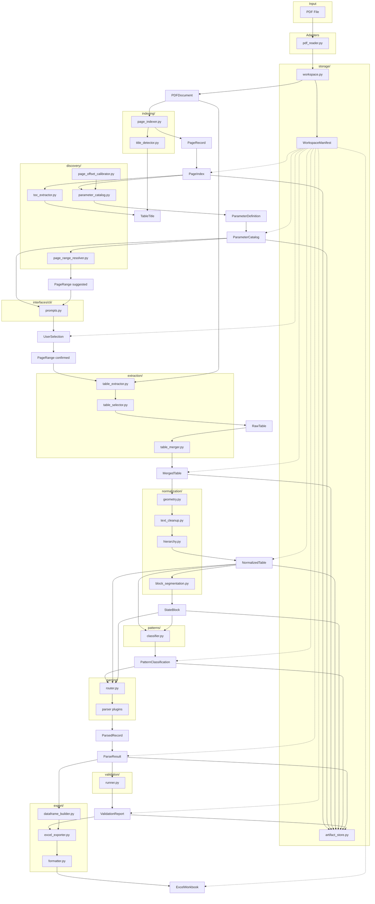

# Data Contract Specification — Regulatory PDF Table Extraction Pipeline

This document defines the **canonical data contracts** that every module must use. Modules communicate only through these objects; no stage may pass ad-hoc dicts, tuples, or library-native types across layer boundaries (internal use inside adapters is allowed, but must be converted at the boundary).

---

## Cross-Cutting Conventions

| Convention | Rule |
|------------|------|
| **Canonical page number** | `pdf_page` — 1-based index in the PDF file. Used everywhere downstream. |
| **Printed / TOC page** | `printed_page` or `toc_page` — value from the document TOC only; never used for extraction without offset calibration. |
| **Identifiers** | `parameter_id`: snake_case stable key (e.g. `banking_charges`). `workspace_id`: SHA-256 of PDF bytes (first 16 hex chars). |
| **Timestamps** | ISO 8601 UTC strings on all persisted artifacts. |
| **Schema version** | Every persisted JSON artifact includes `schema_version` (semver string, e.g. `"1.0.0"`). |
| **Provenance** | Objects that transform other objects carry `source_artifact_id` or `input_hash` for cache invalidation. |
| **Text fields** | Never `null` for strings — use `""`. Missing optional values are omitted from JSON or explicitly `null` per field definition. |
| **Table cells** | Always `List[List[str]]` — all cell values normalized to strings at extraction boundary. |

---

## Contract Definitions

---

### 1. PDFDocument

**Purpose**  
Immutable reference to an input PDF for one pipeline session. Represents identity and metadata, not page content (content is read on demand via `PdfReader` adapter).

| | |
|---|---|
| **Created by** | `storage/workspace.py` (on workspace open), `adapters/pdf_reader.py` (on open) |
| **Consumed by** | `indexing/`, `discovery/`, `extraction/`, `pipeline/session.py`, `interfaces/cli/` |
| **Persist** | Yes — embedded in `WorkspaceManifest` |
| **Format** | JSON (subset inside manifest) |

**Required fields**

| Field | Type | Description |
|-------|------|-------------|
| `path` | string | Absolute or workspace-relative path to PDF file |
| `content_hash` | string | SHA-256 hex digest of file bytes |
| `page_count` | integer | Total pages (≥ 1) |
| `file_size_bytes` | integer | File size |
| `profile_id` | string | Active PDF profile (e.g. `cerc_ursi_v1`) |

**Optional fields**

| Field | Type | Description |
|-------|------|-------------|
| `title` | string | PDF metadata title |
| `created_at` | string | PDF metadata creation date |
| `opened_at` | string | When pipeline opened the document |
| `filename` | string | Basename for display |

**Validation rules**
- `content_hash` must be 64-char hex.
- `page_count` must match actual PDF page count on open (fail fast on mismatch).
- `path` must exist and be readable at workspace creation.
- `profile_id` must resolve to a known profile in config.

---

### 2. PageRecord

**Purpose**  
Indexed snapshot of one PDF page: text, detected table titles, and lightweight metadata for discovery and search routing.

| | |
|---|---|
| **Created by** | `indexing/page_indexer.py`, `indexing/title_detector.py` |
| **Consumed by** | `discovery/parameter_catalog.py`, `discovery/page_range_resolver.py`, `storage/sqlite_index.py`, `interfaces/cli/prompts.py` (preview) |
| **Persist** | Yes — as element of `PageIndex` |
| **Format** | JSON (array inside `page_index.json`); denormalized row in CSV/SQLite |

**Required fields**

| Field | Type | Description |
|-------|------|-------------|
| `pdf_page` | integer | 1-based PDF page index |
| `page_text` | string | Full extracted text (may be empty for image-only pages) |
| `table_titles` | list[`TableTitle`] | Zero or more detected titles on this page |
| `contains_table` | boolean | Whether pdfplumber detected any table geometry |
| `text_length` | integer | Character count of `page_text` |

**Optional fields**

| Field | Type | Description |
|-------|------|-------------|
| `printed_page` | integer | Printed page number if detectable from footer/header |
| `table_count` | integer | Number of tables detected |
| `language_hint` | string | e.g. `"en"`, `"hi"`, `"mixed"` |
| `extraction_warnings` | list[string] | Non-fatal issues (empty text, CID density high) |
| `indexed_at` | string | Timestamp for this record |

**Validation rules**
- `pdf_page` ≥ 1 and ≤ `PDFDocument.page_count`.
- `text_length` == len(`page_text`).
- Each element of `table_titles` must satisfy `TableTitle` validation.
- `contains_table` must be `true` if `table_count` > 0.

---

### 3. PageIndex

**Purpose**  
Aggregate index of all pages for one PDF workspace. Primary discovery input and FTS5 backing data.

| | |
|---|---|
| **Created by** | `indexing/page_indexer.py` |
| **Consumed by** | `discovery/*`, `storage/sqlite_index.py`, `pipeline/stages/index_stage.py`, `interfaces/cli/` |
| **Persist** | Yes |
| **Format** | JSON (canonical) + CSV (human inspection) + SQLite (FTS5 search) |

**Required fields**

| Field | Type | Description |
|-------|------|-------------|
| `schema_version` | string | Contract version |
| `workspace_id` | string | PDF content hash prefix |
| `pdf_hash` | string | Full content hash (matches `PDFDocument.content_hash`) |
| `page_count` | integer | Total pages indexed |
| `pages` | list[`PageRecord`] | One record per page, ordered by `pdf_page` |
| `indexed_at` | string | When index was built |
| `index_version` | integer | Monotonic rebuild counter |

**Optional fields**

| Field | Type | Description |
|-------|------|-------------|
| `pages_with_titles` | integer | Count of pages having ≥ 1 table title |
| `pages_with_tables` | integer | Count of pages with `contains_table == true` |
| `title_anchor_pages` | list[integer] | Sorted list of `pdf_page` values that anchor sections |
| `build_duration_ms` | integer | Indexing performance metric |
| `config_snapshot_hash` | string | Hash of discovery regex config used |

**Validation rules**
- `len(pages)` == `page_count`.
- Pages must be contiguous: `pdf_page` runs 1…N with no gaps or duplicates.
- `pdf_hash` must match workspace manifest.
- Re-index invalidates downstream discovery artifacts (manifest tracks this).

---

### 4. TableTitle

**Purpose**  
Structured representation of a regulatory table heading anchor (e.g. `Table-5(a): Cross Subsidy Surcharge`). Used for section boundary detection and parameter matching.

| | |
|---|---|
| **Created by** | `indexing/title_detector.py`, `discovery/toc_extractor.py` |
| **Consumed by** | `discovery/parameter_catalog.py`, `discovery/page_range_resolver.py` |
| **Persist** | Yes — embedded in `PageRecord` and TOC raw entries |
| **Format** | JSON (nested) |

**Required fields**

| Field | Type | Description |
|-------|------|-------------|
| `raw_text` | string | Exact matched substring from source text |
| `table_number` | string | Normalized ID, e.g. `"5"`, `"5(a)"`, `"3"` |
| `title_text` | string | Human-readable title after the colon |

**Optional fields**

| Field | Type | Description |
|-------|------|-------------|
| `pdf_page` | integer | Page where title was found (when standalone) |
| `printed_page` | integer | Page number from TOC entry (TOC-sourced only) |
| `source` | enum | `"page_scan"` \| `"toc"` \| `"fts"` |
| `match_start` | integer | Char offset in page text |
| `match_end` | integer | Char offset end |
| `confidence` | float | 0.0–1.0 match quality |
| `parameter_id` | string | Resolved parameter if already mapped |

**Validation rules**
- `table_number` matches pattern `^\d+(?:\([a-zA-Z]\))?$` after normalization.
- `title_text` non-empty after trim.
- `raw_text` must contain `table_number` and `title_text`.
- If `source == "toc"`, `printed_page` is required.

---

### 5. ParameterDefinition

**Purpose**  
One discoverable regulatory parameter: identity, display info, suggested location, and routing hints for parsing.

| | |
|---|---|
| **Created by** | `discovery/parameter_catalog.py` |
| **Consumed by** | `discovery/page_range_resolver.py`, `interfaces/cli/prompts.py`, `parsing/router.py`, `validation/runner.py`, `export/dataframe_builder.py` |
| **Persist** | Yes — element of `ParameterCatalog` |
| **Format** | JSON (nested) |

**Required fields**

| Field | Type | Description |
|-------|------|-------------|
| `parameter_id` | string | Stable snake_case key |
| `display_name` | string | User-facing label |
| `table_title` | `TableTitle` | Primary anchor title |
| `supported` | boolean | Whether v1 can extract/parse this parameter |
| `suggested_range` | `PageRange` | Auto-computed page span (PDF index) |

**Optional fields**

| Field | Type | Description |
|-------|------|-------------|
| `toc_start_page` | integer | Printed page from TOC (before offset) |
| `pdf_start_page` | integer | Calibrated PDF start (redundant with range.start if set) |
| `parser_id` | string | From registry, e.g. `narrative_v1` |
| `parser_family` | enum | `narrative` \| `numeric_matrix` \| `wide_to_long` \| `state_block_matrix` \| `simple_matrix` \| `key_value` |
| `pattern_override` | enum | Force `TablePattern` when set |
| `calibration_phrase` | string | Unique phrase for offset calibration |
| `aliases` | list[string] | Search synonyms |
| `parent_parameter_id` | string | For sub-tables (e.g. 5a under open access family) |
| `discovery_source` | enum | `"toc"` \| `"index"` \| `"merged"` |
| `notes` | string | Human notes (unsupported reason, etc.) |

**Validation rules**
- `parameter_id` unique within catalog; matches `^[a-z][a-z0-9_]*$`.
- If `supported == true`, `parser_id` must exist in registry config.
- `suggested_range.start_page` ≤ `suggested_range.end_page`.
- Both range bounds within `[1, page_count]`.
- `table_title.title_text` should fuzzy-match `display_name` (warning if not).

---

### 6. ParameterCatalog

**Purpose**  
Complete list of parameters discovered for one PDF, with catalog-level metadata and calibration results.

| | |
|---|---|
| **Created by** | `discovery/parameter_catalog.py` |
| **Consumed by** | `interfaces/cli/`, `discovery/page_range_resolver.py`, `pipeline/session.py` |
| **Persist** | Yes |
| **Format** | JSON (canonical); optional CSV summary for inspection |

**Required fields**

| Field | Type | Description |
|-------|------|-------------|
| `schema_version` | string | Contract version |
| `workspace_id` | string | PDF workspace ID |
| `generated_at` | string | Build timestamp |
| `parameters` | list[`ParameterDefinition`] | All discovered parameters, sorted by `suggested_range.start_page` |
| `parameter_count` | integer | len(parameters) |
| `supported_count` | integer | Count where `supported == true` |

**Optional fields**

| Field | Type | Description |
|-------|------|-------------|
| `toc_page_offset` | integer | `pdf_page - printed_page` calibration delta |
| `offset_calibration_method` | string | e.g. `"phrase_search"`, `"manual"` |
| `offset_calibration_phrases` | list[object] | `{phrase, toc_page, pdf_page, delta}` audit trail |
| `discovery_sources` | list[string] | Which mechanisms contributed |
| `filtered_spurious` | list[object] | Rejected TOC matches with reason |
| `input_index_version` | integer | `PageIndex.index_version` used |

**Validation rules**
- All `parameter_id` values unique.
- `parameter_count` == len(`parameters`).
- `supported_count` ≤ `parameter_count`.
- Parameters sorted ascending by `suggested_range.start_page`.
- Adjacent parameters should not have overlapping ranges unless documented in `notes`.
- `input_index_version` must match current index or catalog is stale.

---

### 7. PageRange

**Purpose**  
Inclusive page span for extraction of one parameter. Carries provenance so suggested vs user-confirmed ranges are auditable.

| | |
|---|---|
| **Created by** | `discovery/page_range_resolver.py` (suggested), `interfaces/cli/prompts.py` (confirmed) |
| **Consumed by** | `extraction/table_extractor.py`, `discovery/` (preview), `pipeline/stages/extract_stage.py` |
| **Persist** | Yes — suggested in `parameter_ranges.json`; confirmed in `{param_id}/confirmed_range.json` |
| **Format** | JSON |

**Required fields**

| Field | Type | Description |
|-------|------|-------------|
| `start_page` | integer | First PDF page (inclusive) |
| `end_page` | integer | Last PDF page (inclusive) |
| `source` | enum | `"anchor_chain"` \| `"toc_next_start"` \| `"user_confirmed"` \| `"user_override"` \| `"query_resolved"` |

**Optional fields**

| Field | Type | Description |
|-------|------|-------------|
| `parameter_id` | string | Parameter this range applies to |
| `page_list` | list[integer] | Explicit page list if non-contiguous (rare) |
| `boundary_rule` | string | Rule used to compute end boundary |
| `anchor_start_title` | `TableTitle` | Title that opened the range |
| `anchor_end_title` | `TableTitle` | Next title that closed the range |
| `confirmed_at` | string | When user approved |
| `confirmed_by` | string | `"cli"` \| `"api"` \| `"auto"` |

**Validation rules**
- `start_page` ≥ 1, `end_page` ≥ `start_page`.
- All pages ≤ `PDFDocument.page_count`.
- If `page_list` provided, must equal contiguous expansion of start/end unless explicitly non-contiguous mode.
- `source == "user_confirmed"` requires `confirmed_at`.

---

### 8. UserSelection

**Purpose**  
Captures user intent for one pipeline run: which parameters to process, confirmed ranges, optional pattern overrides, and export preferences.

| | |
|---|---|
| **Created by** | `interfaces/cli/prompts.py`, `pipeline/session.py` |
| **Consumed by** | `pipeline/runner.py`, all downstream stages for selected parameters |
| **Persist** | Yes — session checkpoint |
| **Format** | JSON |

**Required fields**

| Field | Type | Description |
|-------|------|-------------|
| `selection_id` | string | UUID for this selection event |
| `created_at` | string | Timestamp |
| `selection_mode` | enum | `"catalog"` \| `"query"` \| `"batch"` \| `"single"` |
| `parameter_ids` | list[string] | Parameters to extract/parse/export |
| `confirmed_ranges` | map[string → `PageRange`] | One confirmed range per parameter_id |

**Optional fields**

| Field | Type | Description |
|-------|------|-------------|
| `query_text` | string | Natural-language query if mode is `"query"` |
| `query_resolution` | object | `{matched_parameter_id, score, matched_pages}` |
| `confirmed_patterns` | map[string → enum] | User-confirmed `TablePattern` per parameter |
| `export_mode` | enum | `"single_workbook"` \| `"per_parameter"` |
| `export_path` | string | User-specified output path override |
| `skip_validation` | boolean | Default false |
| `force_reextract` | boolean | Bypass extraction cache |

**Validation rules**
- Every `parameter_id` in `parameter_ids` must exist in `ParameterCatalog`.
- Every `parameter_id` must have entry in `confirmed_ranges`.
- Ranges must satisfy `PageRange` validation.
- Unsupported parameters in selection → error unless `--force` flag (CLI concern; contract marks invalid).
- `query_text` required when `selection_mode == "query"`.

---

### 9. RawTable

**Purpose**  
Unprocessed table data from a **single PDF page** within a parameter's range. Preserves pdfplumber output faithfully for debugging and merge input.

| | |
|---|---|
| **Created by** | `extraction/table_extractor.py`, `extraction/table_selector.py` |
| **Consumed by** | `extraction/table_merger.py`, `normalization/geometry.py` (optional direct path) |
| **Persist** | Yes |
| **Format** | JSON |

**Required fields**

| Field | Type | Description |
|-------|------|-------------|
| `parameter_id` | string | Owning parameter |
| `pdf_page` | integer | Source page |
| `rows` | list[list[string]] | Selected primary table cells (all strings) |
| `row_count` | integer | len(rows) |
| `column_count` | integer | Max column width |
| `selected_table_index` | integer | Which candidate table was chosen (0-based) |

**Optional fields**

| Field | Type | Description |
|-------|------|-------------|
| `candidate_tables` | list[object] | `{index, row_count, column_count, area_score}` for all tables on page |
| `selection_heuristic` | string | e.g. `"largest_area"` |
| `bbox` | list[float] | Table bounding box if available |
| `extracted_at` | string | Timestamp |
| `extraction_warnings` | list[string] | Empty table, multiple equal candidates |
| `page_range_id` | string | Hash of confirmed range for cache key |

**Validation rules**
- `row_count` == len(`rows`); `column_count` == max row length (≥ 1 if non-empty).
- All cell values are strings (no null cells — use `""`).
- `pdf_page` must fall within confirmed `PageRange` for `parameter_id`.
- If `rows` empty, `extraction_warnings` must be non-empty.

---

### 10. MergedTable

**Purpose**  
Multi-page concatenation of `RawTable` instances after primary-table selection, repeated-header removal, and row alignment. Input to normalization.

| | |
|---|---|
| **Created by** | `extraction/table_merger.py` |
| **Consumed by** | `normalization/geometry.py`, `normalization/text_cleanup.py`, `patterns/features.py` |
| **Persist** | Yes |
| **Format** | JSON |

**Required fields**

| Field | Type | Description |
|-------|------|-------------|
| `parameter_id` | string | Owning parameter |
| `source_pages` | list[integer] | PDF pages merged in order |
| `rows` | list[list[string]] | Concatenated rows post header-strip |
| `row_count` | integer | Total rows |
| `column_count` | integer | Normalized column width |
| `headers_stripped_count` | integer | Number of repeated header blocks removed |

**Optional fields**

| Field | Type | Description |
|-------|------|-------------|
| `header_signature` | list[string] | Detected header row text for audit |
| `merge_log` | list[object] | Per-page `{pdf_page, rows_added, headers_removed}` |
| `page_range` | `PageRange` | Range that produced this merge |
| `merged_at` | string | Timestamp |
| `input_raw_table_hashes` | list[string] | Per-page RawTable content hashes |

**Validation rules**
- `source_pages` sorted ascending, no duplicates.
- `row_count` == len(`rows`).
- `column_count` consistent across all rows (pad with `""` if needed).
- At least one source page unless empty extraction documented.
- `headers_stripped_count` ≥ 0.

---

### 11. NormalizedTable

**Purpose**  
Structurally and lexically cleaned table ready for pattern classification and semantic parsing. Geometry normalized, text cleaned, hierarchy propagated (when applicable).

| | |
|---|---|
| **Created by** | `normalization/geometry.py`, `normalization/text_cleanup.py`, `normalization/hierarchy.py` |
| **Consumed by** | `patterns/classifier.py`, `normalization/block_segmentation.py`, `parsing/router.py` |
| **Persist** | Yes |
| **Format** | JSON |

**Required fields**

| Field | Type | Description |
|-------|------|-------------|
| `parameter_id` | string | Owning parameter |
| `rows` | list[list[string]] | Cleaned cell grid |
| `row_count` | integer | Row count |
| `column_count` | integer | Column count |
| `normalization_steps` | list[string] | Ordered steps applied, e.g. `["drop_empty_cols", "cid_cleanup", "state_propagation"]` |

**Optional fields**

| Field | Type | Description |
|-------|------|-------------|
| `row_labels` | list[enum] | Per-row classification: `"header"` \| `"master"` \| `"child"` \| `"continuation"` \| `"data"` \| `"garbage"` |
| `source_merged_table_hash` | string | Lineage from MergedTable |
| `normalized_at` | string | Timestamp |
| `cleanup_stats` | object | `{empty_rows_removed, empty_cols_removed, cid_tokens_removed}` |
| `wide_format` | boolean | Hint that wide→long may be needed |

**Validation rules**
- No completely empty rows or columns (geometry step guarantee).
- `(cid:NNN)` tokens should be absent or flagged in `cleanup_stats`.
- If `row_labels` present, len == `row_count`.
- `normalization_steps` non-empty.

---

### 12. PatternClassification

**Purpose**  
Automatic (or override) structural pattern assignment for routing to the correct parser family.

| | |
|---|---|
| **Created by** | `patterns/classifier.py` |
| **Consumed by** | `parsing/router.py`, `interfaces/cli/prompts.py` (low-confidence confirm), `validation/runner.py` |
| **Persist** | Yes |
| **Format** | JSON |

**Required fields**

| Field | Type | Description |
|-------|------|-------------|
| `parameter_id` | string | Owning parameter |
| `pattern` | enum | See `TablePattern` values below |
| `confidence` | float | 0.0–1.0 |
| `classified_at` | string | Timestamp |
| `routing_source` | enum | `"config_override"` \| `"classifier"` \| `"user_confirmed"` |

**Optional fields**

| Field | Type | Description |
|-------|------|-------------|
| `parser_family` | enum | Recommended parser family |
| `parser_id` | string | Specific plugin to invoke |
| `signals` | map[string → float] | Feature scores, e.g. `{category_header: 0.9, voltage_keywords: 0.3}` |
| `runner_up_pattern` | enum | Second-best pattern |
| `runner_up_confidence` | float | Second-best score |
| `requires_user_confirmation` | boolean | True if confidence < threshold |
| `input_table_hash` | string | NormalizedTable hash |

**`TablePattern` enum values**  
`simple_flat`, `hierarchical_parent_child`, `continuation_rows`, `repeated_headers`, `multi_page`, `numeric_matrix`, `wide_table`, `state_block_matrix`, `simple_matrix`, `key_value`, `unknown`

**Validation rules**
- `confidence` ∈ [0.0, 1.0].
- If `routing_source == "config_override"`, `confidence` should be 1.0.
- `pattern == "unknown"` requires `requires_user_confirmation == true` or blocks parse.
- `parser_id` must be consistent with `parser_family` per registry.

---

### 13. StateBlock

**Purpose**  
Segment of a normalized matrix table belonging to one Indian state/UT — used by block-level parsers (cross-subsidy, open access). Enables state-scoped parsing and future query retrieval.

| | |
|---|---|
| **Created by** | `normalization/block_segmentation.py` |
| **Consumed by** | `parsing/families/state_block_matrix.py`, `simple_matrix.py`, `key_value.py` |
| **Persist** | Yes (when segmentation runs) |
| **Format** | JSON (array of blocks) |

**Required fields**

| Field | Type | Description |
|-------|------|-------------|
| `block_id` | string | Stable ID, e.g. `"andhra_pradesh_50_12"` |
| `parameter_id` | string | Owning parameter |
| `state` | string | Canonical state name |
| `start_row` | integer | 0-based index into NormalizedTable.rows |
| `end_row` | integer | Inclusive end row index |
| `rows` | list[list[string]] | Slice of normalized rows for this block |
| `start_page` | integer | PDF page where block begins |

**Optional fields**

| Field | Type | Description |
|-------|------|-------------|
| `end_page` | integer | PDF page where block ends |
| `year_label` | string | Detected year, e.g. `"2023-24"` |
| `block_parser_hint` | enum | `"matrix"` \| `"simple_matrix"` \| `"key_value"` |
| `utility_columns` | list[string] | Detected utility column headers |
| `sections` | list[string] | HT/LT/EHT section names within block |
| `row_count` | integer | len(rows) |

**Validation rules**
- `state` must resolve via canonical state catalog (or alias map).
- `start_row` ≤ `end_row`; row slice length == `end_row - start_row + 1`.
- Blocks for same parameter must not overlap row ranges.
- `block_id` unique within parameter.

---

### 14. ParsedRecord

**Purpose**  
One canonical semantic output row for warehouse storage — the uniform unit parsers emit regardless of table shape.

| | |
|---|---|
| **Created by** | `parsing/families/*` (via parser plugins) |
| **Consumed by** | `validation/runner.py`, `export/dataframe_builder.py` |
| **Persist** | Yes — as element of `ParseResult` |
| **Format** | JSON (nested in records array) |

**Required fields**

| Field | Type | Description |
|-------|------|-------------|
| `record_id` | string | UUID or deterministic hash within parse run |
| `parameter_id` | string | Source parameter |
| `fields` | map[string → scalar] | Schema-defined payload; scalars are string, number, or boolean |

**Optional fields**

| Field | Type | Description |
|-------|------|-------------|
| `source_pages` | list[integer] | PDF pages contributing to this record |
| `source_rows` | list[integer] | Row indices in NormalizedTable |
| `parser_id` | string | Parser that emitted this record |
| `parser_version` | string | Plugin version |
| `confidence` | float | Per-record parse confidence |
| `warnings` | list[string] | Non-fatal parse notes |
| `provenance` | object | `{block_id, state, discom, ...}` trace keys |

**Representative `fields` schemas by parameter** (defined in parameter YAML, enforced at validation)

| Parameter | Required keys in `fields` |
|-----------|---------------------------|
| Banking Charges | `state`, `discom`, `charge`, `period`, `policy` |
| Transmission | `state`, `utility`, `year`, `long_medium_charge`, `long_medium_unit`, `short_term_charge`, `short_term_unit` |
| Additional Surcharge | `state`, `year`, `additional_surcharge` |
| Wheeling | `state`, `utility`, `year`, `voltage_level`, `wheeling_charge` |
| Cross Subsidy (matrix) | `state`, `category`, `utility`, `value` (+ section context in provenance) |

**Validation rules**
- `fields` must contain all required columns per parameter schema in config.
- No null required field values.
- `state` values should canonicalize to `config/catalogs/states.yaml`.
- `record_id` unique within `ParseResult`.

---

### 15. ParseResult

**Purpose**  
Complete output of parsing one parameter: records plus metadata for validation, export, and audit.

| | |
|---|---|
| **Created by** | `parsing/router.py` + parser plugins |
| **Consumed by** | `validation/runner.py`, `export/dataframe_builder.py`, `pipeline/stages/parse_stage.py` |
| **Persist** | Yes |
| **Format** | JSON |

**Required fields**

| Field | Type | Description |
|-------|------|-------------|
| `parameter_id` | string | Parsed parameter |
| `records` | list[`ParsedRecord`] | All emitted records |
| `record_count` | integer | len(records) |
| `parser_id` | string | Plugin used |
| `pattern` | enum | Pattern that routed parse |
| `parsed_at` | string | Timestamp |
| `status` | enum | `"success"` \| `"partial"` \| `"failed"` |

**Optional fields**

| Field | Type | Description |
|-------|------|-------------|
| `parser_family` | enum | Family name |
| `parse_metadata` | object | `{rows_processed, rows_skipped, blocks_processed, duration_ms}` |
| `classification` | `PatternClassification` | Copy for audit |
| `input_table_hash` | string | NormalizedTable hash |
| `state_blocks_used` | list[string] | Block IDs if block parsers ran |
| `errors` | list[object] | `{code, message, row}` fatal issues |
| `warnings` | list[string] | Aggregate warnings |

**Validation rules**
- `record_count` == len(`records`).
- `status == "failed"` implies `record_count == 0` and `errors` non-empty.
- `status == "success"` implies zero fatal `errors`.
- Each record's `parameter_id` matches parent.

---

### 16. ValidationReport

**Purpose**  
Quality gate results after parsing — warnings and errors against parameter-specific rules before export.

| | |
|---|---|
| **Created by** | `validation/runner.py` |
| **Consumed by** | `pipeline/runner.py`, `interfaces/cli/`, `export/excel_exporter.py` (gate decision) |
| **Persist** | Yes |
| **Format** | JSON |

**Required fields**

| Field | Type | Description |
|-------|------|-------------|
| `parameter_id` | string | Validated parameter |
| `validated_at` | string | Timestamp |
| `passed` | boolean | True if no blocking errors |
| `error_count` | integer | Blocking issues |
| `warning_count` | integer | Non-blocking issues |
| `checks` | list[object] | `{rule_id, severity, passed, message, details}` |

**Optional fields**

| Field | Type | Description |
|-------|------|-------------|
| `parse_result_hash` | string | Input lineage |
| `summary` | object | `{record_count, states_covered, null_rate_by_column}` |
| `expected_thresholds` | object | From parameter YAML |
| `export_allowed` | boolean | Computed gate (errors may block) |

**Validation rules**
- Each check has `severity` ∈ `"error"` \| `"warning"` \| `"info"`.
- `passed == true` iff no check with `severity == "error"` and `passed == false`.
- `error_count` / `warning_count` must match checks tallies.

**Typical rules (configured per parameter)**
- Minimum record count
- Required field non-null rate
- State coverage (≥ 28 states + UTs or profile-specific)
- No duplicate composite keys
- Numeric field parseability

---

### 17. ExcelWorkbook

**Purpose**  
Final deliverable: formatted multi-sheet (or single-sheet) Excel warehouse for one or more parameters.

| | |
|---|---|
| **Created by** | `export/excel_exporter.py`, `export/formatter.py` |
| **Consumed by** | End user, optional future query layer |
| **Persist** | Yes |
| **Format** | XLSX (binary); metadata sidecar JSON optional |

**Required fields (metadata envelope — the file itself is XLSX)**

| Field | Type | Description |
|-------|------|-------------|
| `workbook_id` | string | UUID |
| `path` | string | Output file path |
| `created_at` | string | Export timestamp |
| `sheets` | list[object] | `{sheet_name, parameter_id, row_count, column_names}` |
| `sheet_count` | integer | Number of sheets |
| `source_workspace_id` | string | PDF workspace |

**Optional fields**

| Field | Type | Description |
|-------|------|-------------|
| `format_spec` | object | `{freeze_panes, bold_headers, max_column_width}` applied |
| `validation_summary` | map[string → boolean] | Per-parameter pass/fail |
| `export_mode` | enum | `"single_workbook"` \| `"per_parameter"` |
| `file_size_bytes` | integer | Output size |

**Validation rules**
- Each `sheet_name` unique; matches parameter YAML `sheet_name` if configured.
- Column order matches parameter schema definition.
- `row_count` per sheet matches source `ParseResult.record_count` (excluding header row).
- File must be openable as valid XLSX.

---

### 18. WorkspaceManifest

**Purpose**  
Root index for a PDF-scoped workspace: identity, stage completion, artifact pointers, cache invalidation state.

| | |
|---|---|
| **Created by** | `storage/workspace.py` |
| **Consumed by** | All stages (idempotency checks), `pipeline/runner.py`, `scripts/validate_workspace.py` |
| **Persist** | Yes |
| **Format** | JSON |

**Required fields**

| Field | Type | Description |
|-------|------|-------------|
| `schema_version` | string | Manifest contract version |
| `workspace_id` | string | PDF hash prefix |
| `pdf` | `PDFDocument` | Embedded PDF reference |
| `created_at` | string | Workspace creation time |
| `updated_at` | string | Last mutation time |
| `profile_id` | string | Active profile |
| `stages` | map[string → object] | Per-stage `{status, completed_at, artifact_paths, input_hash}` |

**Stage keys**  
`index`, `discover`, `select`, `extract`, `normalize`, `classify`, `parse`, `validate`, `export`

**Optional fields**

| Field | Type | Description |
|-------|------|-------------|
| `user_selection` | `UserSelection` | Latest selection |
| `parameter_status` | map[string → object] | Per-parameter downstream completion |
| `config_hashes` | map[string → string] | Config files used |
| `invalidated_stages` | list[string] | Stages needing rerun |
| `version` | integer | Manifest revision counter |

**Validation rules**
- `workspace_id` derived from `pdf.content_hash`.
- Stage `status` ∈ `"pending"` \| `"complete"` \| `"stale"` \| `"failed"`.
- Downstream stages marked `stale` when upstream `input_hash` changes.
- `updated_at` ≥ `created_at`.

---

## Complete Object Lifecycle

```text
PDF file
   │
   ▼
PDFDocument ──────────────────────────────────────────────┐
   │                                                       │
   ▼                                                       │
[index stage]                                              │
   │                                                       │
   ├──► PageRecord (×N pages)                             │
   │         └── embeds TableTitle[]                      │
   │                                                       │
   └──► PageIndex                                         │
            │                                              │
            ▼                                              │
[discover stage]                                           │
   │                                                       │
   ├──► TableTitle (from TOC + page scan)                │
   ├──► ParameterDefinition (×M)                          │
   ├──► ParameterCatalog                                  │
   └──► PageRange (suggested, per parameter)               │
            │                                              │
            ▼                                              │
[user / routing layer]                                     │
   │                                                       │
   └──► UserSelection                                      │
            └── confirmed PageRange (per parameter)      │
            │                                              │
            ▼                                              │
[extract stage]                                            │
   │                                                       │
   ├──► RawTable (× pages in range)                       │
   └──► MergedTable                                        │
            │                                              │
            ▼                                              │
[normalize stage]                                          │
   │                                                       │
   ├──► NormalizedTable                                   │
   └──► StateBlock[] (optional, matrix parameters)        │
            │                                              │
            ▼                                              │
[classify stage]                                           │
   │                                                       │
   └──► PatternClassification                            │
            │                                              │
            ▼                                              │
[parse stage]                                              │
   │                                                       │
   ├──► ParsedRecord (×R)                                 │
   └──► ParseResult                                       │
            │                                              │
            ▼                                              │
[validate stage]                                           │
   │                                                       │
   └──► ValidationReport                                  │
            │                                              │
            ▼                                              │
[export stage]                                             │
   │                                                       │
   └──► ExcelWorkbook                                      │
            │                                              │
            ▼                                              │
       (deliverable .xlsx)                                 │
                                                           │
WorkspaceManifest ◄── tracks all stages & artifact paths ──┘
```

---

## Object-Flow Diagram (Module Boundaries)



---

## Persistence Matrix

| Object | Persist | Path (under `workspaces/{hash}/`) | Format |
|--------|---------|-------------------------------------|--------|
| PDFDocument | Yes (in manifest) | `manifest.json` | JSON |
| PageRecord | Yes | `index/page_index.json` | JSON |
| PageIndex | Yes | `index/page_index.json`, `index/page_index.csv`, `index/page_index.db` | JSON + CSV + SQLite |
| TableTitle | Yes (embedded) | Inside page index + `discovery/toc_raw.json` | JSON |
| ParameterDefinition | Yes | `discovery/parameter_catalog.json` | JSON |
| ParameterCatalog | Yes | `discovery/parameter_catalog.json`, `discovery/parameter_ranges.json` | JSON |
| PageRange | Yes | `discovery/parameter_ranges.json`, `discovery/{param}/confirmed_range.json` | JSON |
| UserSelection | Yes | `discovery/user_selection.json` | JSON |
| RawTable | Yes | `extraction/{param}/raw_pages.json` | JSON |
| MergedTable | Yes | `extraction/{param}/raw_merged.json` | JSON |
| NormalizedTable | Yes | `extraction/{param}/normalized.json` | JSON |
| PatternClassification | Yes | `parsing/{param}/pattern.json` | JSON |
| StateBlock | Yes (when used) | `extraction/{param}/state_blocks.json` | JSON |
| ParsedRecord | Yes | `parsing/{param}/records.json` | JSON |
| ParseResult | Yes | `parsing/{param}/records.json` | JSON |
| ValidationReport | Yes | `parsing/{param}/validation.json` | JSON |
| ExcelWorkbook | Yes | `export/Regulatory_Parameter_Warehouse.xlsx` or `export/{param}.xlsx` | XLSX |
| WorkspaceManifest | Yes | `manifest.json` | JSON |

**Ephemeral (do not persist):** open `PdfReader` handles, in-memory pandas DataFrames (rebuild from JSON at export), CLI prompt UI state.

---

## Cache Invalidation Dependencies

```text
PDF bytes change          → entire workspace invalidated
PageIndex rebuild         → ParameterCatalog, all PageRanges, all downstream
ParameterCatalog change   → suggested PageRanges, UserSelection review
confirmed PageRange change → RawTable, MergedTable, NormalizedTable, StateBlock,
                               PatternClassification, ParseResult, ValidationReport,
                               ExcelWorkbook for that parameter only
Pattern override          → ParseResult downstream for that parameter
Parser config change      → ParseResult downstream (re-parse only)
Validation rule change    → ValidationReport, export gate only
```

Each persisted artifact should store `input_hash` computed from its direct inputs so `WorkspaceManifest` can mark stages `stale` without re-running unaffected parameters.

---

## Module Communication Rule Summary

| Rule | Enforcement |
|------|-------------|
| Only `domain/` types cross stage boundaries | Lint / import checker |
| Adapters convert library types at the edge | pdfplumber tables → `RawTable.rows` |
| Parsers emit `ParseResult` only | No direct Excel writes from parsing |
| Export reads `ParseResult` + `ValidationReport` | Never reads PDF or RawTable |
| Discovery never triggers extraction | Location resolution only |
| Classifier never invokes parsers | Prevents feedback loops |

---

## Design Decisions Encoded in These Contracts

1. **PDF page index is canonical** — `printed_page` / `toc_page` are metadata only; offset lives in `ParameterCatalog.toc_page_offset`.
2. **RawTable is per-page; MergedTable is the normalization input** — clear seam for multi-page merge debugging.
3. **StateBlock is optional** — only produced for matrix-family parameters; parsers accept `NormalizedTable` + optional `List[StateBlock]`.
4. **ParsedRecord uses schema-flexible `fields` map** — column contracts live in parameter YAML; validation enforces them.
5. **UserSelection is first-class** — confirmed ranges are auditable artifacts, not ephemeral CLI state.
6. **WorkspaceManifest is the orchestration truth** — enables idempotent stage skips and multi-PDF isolation.

---

This specification is ready to drive `domain/models.py` implementation: each object maps 1:1 to a dataclass (or typed dict protocol), and `storage/artifact_store.py` paths align with the persistence matrix above. When you want to proceed, the next step is implementing `domain/` + `config/schema.py` validation against these field rules — still without business logic.