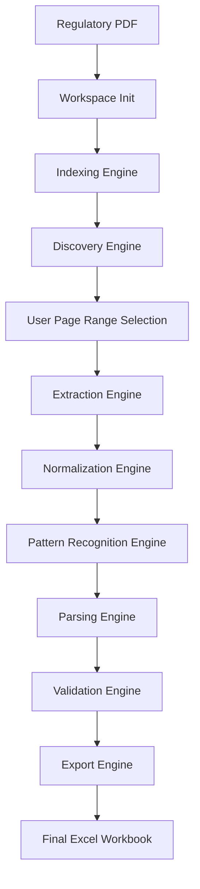

# Regulatory PDF Table Scraper Developer Guide

This developer guide serves as the onboarding manual, architecture walkthrough, and operation guide for developers working on the DeFi Wallet and Regulatory PDF Table Scraper project. It acts as the comprehensive source of truth for the system's design and usage.

---

# 1. Project Overview

## Project Objective
The Regulatory PDF Table Scraper is a production-ready ETL pipeline designed to ingest unstructured, multi-page regulatory tariff and banking charges PDF documents, automatically locate tables corresponding to specific regulatory parameters, clean and normalize their structure, classify their layout patterns, execute tailored parses, and export structured, validated data sheets to Microsoft Excel workbooks.

## Supported Regulatory Parameters
The system is configured to support key regulatory parameters including:
* **Wheeling Charges (`wheeling_charges`)**: Page-wise open access voltage levels and cost matrices.
* **Cross-Subsidy Surcharges (`cross_subsidy_surcharges`)**: Section-scoped HT/LT open access matrices.
* **Transmission Charges (`transmission_charges`)**: National or state-level transmission rate tables.
* **Additional Surcharges (`additional_surcharges`)**: Consumer category surcharges.

## Overall Architecture
The system follows a modular pipeline design, separating concerns into discrete engines:


---

# 2. Folder Structure

The project directory is structured as follows:

```
├── config/                  # Global and parameter-specific YAML settings
│   ├── catalogs/            # State and utility alias catalogs
│   ├── defaults/            # Defaults for indexers, classifiers, and exporters
│   ├── parameters/          # Config sheets per parameter (e.g. wheeling_charges.yaml)
│   ├── profiles/            # Execution profiles mapping PDFs to states
│   └── registry.yaml        # Active parser plugin registry mappings
├── docs/                    # Architecture and developer documentation
│   ├── data_contracts.md    # Dataclass attribute schemas (Source of Truth)
│   └── DEVELOPER_GUIDE.md   # This developer guide
├── src/
│   └── table_scraper/
│       ├── adapters/        # Third-party PDF library wrappers (pdfplumber)
│       ├── config/          # Configurations loader modules
│       ├── discovery/       # TOC parsing and calibration algorithms
│       ├── domain/          # Core enums, models, and protocols
│       ├── export/          # Excel writer wrappers and openpyxl formatting
│       ├── extraction/      # Table selectors and page-concatenators
│       ├── indexing/        # FTS databases and page indexing runner
│       ├── interfaces/      # CLI client application commands
│       ├── normalization/   # Geometry aligners and state block segmenters
│       ├── parsing/         # Parser registry, router, and family plugins
│       ├── storage/         # Workspaces and local ArtifactStores
│       └── validation/      # Rule runner and validation checkers
└── tests/
    └── unit/                # Unit test suite
```

---

# 3. Installation

## Requirements
* **Python**: 3.9+ (3.10 recommended)
* **Dependencies**: `pdfplumber`, `openpyxl`, `pandas`, `pyyaml`

## Setup Instructions

1. **Clone the repository**:
   ```bash
   git clone <repository_url> table_scraper
   cd table_scraper
   ```

2. **Create a virtual environment**:
   ```powershell
   python -m venv .venv
   .venv\Scripts\Activate.ps1
   ```

3. **Install dependencies and project in editable mode**:
   ```bash
   python -m pip install --upgrade pip
   python -m pip install -e .
   ```

---

# 4. Configuration

All application configurations reside within the `config/` directory.

* **Profiles (`config/profiles/`)**: Tie a specific PDF file name to a regulatory profile (e.g. `gujarat.yaml`), specifying the default state, utility aliases, and which parameters are supported.
* **Parameters (`config/parameters/`)**: Define parameters, calibration phrases, target schemas, unit overrides, and validation rule thresholds.
* **Parser Registry (`config/registry.yaml`)**: Maps specific `TablePattern` values or parameter overrides to parser plugin identifiers.

---

# 5. Running the Project

You can run the pipeline sequentially using individual commands or trigger the full interactive pipeline.

### Full Pipeline Run (Interactive CLI)
To start the pipeline interactively:
```bash
python -m table_scraper.interfaces.cli.app --profile default
```

### Scripted Resume
To run the scraper on a target PDF and specify an output location:
```bash
python -m table_scraper.interfaces.cli.app c:\Users\hp\OneDrive\Desktop\TLG\table_scraper\sample.pdf --profile gujarat --output final_output.xlsx
```

---

# 6. Pipeline Walkthrough

The pipeline processes files in the following order:

1. **Index Stage (`index`)**: Reads the PDF, builds `PageIndex` storing raw text/tables per page.
2. **Discover Stage (`discover`)**: Parses the Table of Contents (TOC) and matches titles to aliases to build the `ParameterCatalog`.
3. **Select Stage (`select`)**: Confirms parameter choices and adjusts page ranges.
4. **Extract Stage (`extract`)**: Pulls `RawTable` tables per page and combines them into a `MergedTable`.
5. **Normalize Stage (`normalize`)**: Corrects cell geometries, propagates column hierarchies, and groups tables into `StateBlock` blocks.
6. **Classify Stage (`classify`)**: Scores features against signatures to produce a `PatternClassification`.
7. **Parse Stage (`parse`)**: Routes the table to a `BaseParser` subclass and yields `ParsedRecord` records.
8. **Validate Stage (`validate`)**: Evaluates records against rules, yielding a `ValidationReport`.
9. **Export Stage (`export`)**: Melts validated results into pandas DataFrames and writes a styled `.xlsx` file.

---

# 7. Workspace

Every input PDF receives an isolated workspace directory:

* **Location**: `<user_home>/.gemini/antigravity-ide/workspaces/<workspace_id>/`
* **Workspace ID**: The first 16 characters of the PDF content's SHA-256 hash.
* **Resume Behavior**: If `manifest.json` indicates that a stage's status is `complete` and its input hash is unchanged, the stage is skipped and cached results are loaded.

---

# 8. Artifact Types

The system reads and writes the following artifacts:

| Artifact Kind | Ext | Description |
|---|---|---|
| **`manifest.json`** | JSON | The root index tracking workspace versioning and stage statuses. |
| **`page_index.json`** | JSON | Searchable page text length and table geometry. |
| **`parameter_catalog.json`**| JSON | Detected regulatory parameters and suggested page ranges. |
| **`raw_merged.json`** | JSON | Merged multi-page raw string cell tables. |
| **`normalized.json`** | JSON | Structured table with clean text and forward-filled hierarchies. |
| **`state_blocks.json`** | JSON | Partitioned state, utility, and year sections. |
| **`records.json`** | JSON | List of semantic output ParsedRecords. |
| **`validation.json`** | JSON | Quality checks results and export gate status. |
| **`excel`** | XLSX | Fully styled deliverable workbook. |

---

# 9. Parser Architecture

* **Pattern Classification**: Scores the structure of normalized tables against predefined layout signatures to guess the correct parser family.
* **Parser Registry**: Maps TablePattern models to BaseParser plugin class instances.
* **Parser Router**: Invokes the selected parser plugin and records output provenance.
* **Parser Families**:
  * `SimpleMatrixParser`: Flattened grids of category vs utility columns.
  * `NumericMatrixParser`: State/utility x year or cost matrix grids.
  * `WideToLongParser`: Table structures with wide voltage columns (EHT, HT, LT).
  * `StateBlockMatrixParser`: Open access matrix tables scoped inside state blocks.
  * `KeyValueParser`: Flat two-column parameter metric-value tables.
  * `NarrativeParser`: Parent-child text narrative columns.

---

# 10. Supporting a New Regulatory PDF

To add support for a completely new state regulatory PDF (e.g. Maharashtra):

1. **Add Profile**: Create `config/profiles/maharashtra.yaml`:
   ```yaml
   profile_id: maharashtra
   state_name: Maharashtra
   supported_parameters:
     - wheeling_charges
     - cross_subsidy_surcharges
   ```
2. **Add Parameter Settings**: If needed, configure aliases or regex patterns in `config/parameters/wheeling_charges.yaml`.
3. **Register Parser Customizations**: Add override entries in `config/registry.yaml` if the layout deviates from standard family mappings.

---

# 11. Debugging

### Page Offset Mismatch
* **Symptom**: Calibration delta is miscalculated, causing extraction to run on incorrect pages.
* **Fix**: Check `calibration_phrase` in the parameter YAML configuration and make sure it exactly matches the text index on the target page.

### Table Not Detected
* **Symptom**: Index stage reports 0 tables extracted from a page.
* **Fix**: Verify the page numbers are 1-based and run the `tests/` validation tests to inspect pdfplumber's raw table output bounds.

### Wrong Parser Selected
* **Symptom**: Normalization works but router crashes or maps columns to incorrect fields.
* **Fix**: Update the `signatures.yaml` weight thresholds or add a `force_pattern` override to the parameter config profile.

---

# 12. Logging

* **Location**: Logs are printed to stderr/stdout during pipeline runs and recorded in the `.system_generated/logs/transcript.jsonl` workspace files.
* **Intermediate Artifacts**: Check the workspace subfolders (e.g. `extraction/<param>/`, `parsing/<param>/`) to view the exact state of `normalized.json` or `state_blocks.json` at every step of execution.

---

# 13. Development Workflow

When introducing features or modifications:
1. **Modify Parser/Code**: Work strictly within `src/table_scraper/`.
2. **Verify Compilation**:
   ```bash
   python -c "import table_scraper.pipeline.runner"
   ```
3. **Run Unit Tests**:
   ```bash
   python -m unittest discover -s tests/unit
   ```
4. **Inspect Local Workspace Workspace Manifest**: Open `manifest.json` under your workspace root to verify that your change successfully registered its stage updates.

---

# 14. Command Reference

### Dependencies Installation
```bash
python -m pip install -e .
```

### Full Run
```bash
python -m table_scraper.interfaces.cli.app --profile default
```

### Clean Workspace
```bash
rm -rf ~/.gemini/antigravity-ide/workspaces/*
```

---

# 15. Complete Example

In a typical execution flow for ` sample.pdf` using profile `gujarat` and parameter `wheeling_charges`:

1. **`index`**: `index/page_index.json` is created indexing pages 1 to 50.
2. **`discover`**: `discovery/parameter_catalog.json` identifies `wheeling_charges` starting on page 14.
3. **`select`**: `discovery/user_selection.json` records that the user accepted the suggested range of 14-16.
4. **`extract`**: `extraction/wheeling_charges/raw_merged.json` merges cells across pages 14, 15, and 16.
5. **`normalize`**: `extraction/wheeling_charges/normalized.json` propagates parent columns and fills empty categories.
6. **`classify`**: `parsing/wheeling_charges/pattern.json` classifies the layout as `WIDE_TABLE`.
7. **`parse`**: `parsing/wheeling_charges/records.json` parses voltage values (EHT, HT, LT).
8. **`validate`**: `parsing/wheeling_charges/validation.json` verifies that states match canonical lists.
9. **`export`**: `export/Regulatory_Parameter_Warehouse.xlsx` is created with a formatted sheet `wheeling_charges`.

---

# 16. Future Improvements

* **Multithreading**: Extract raw tables in parallel across different pages to reduce IO latency.
* **Fuzzy Parsing**: Incorporate fuzzy matching algorithms for state name cleanup in `validation/runner.py` to handle minor OCR spellcheck errors.
* **Multiple Output Workbooks**: Support exporting single parameter sheets to separate files by specifying a `per_parameter` flag in the CLI arguments.
