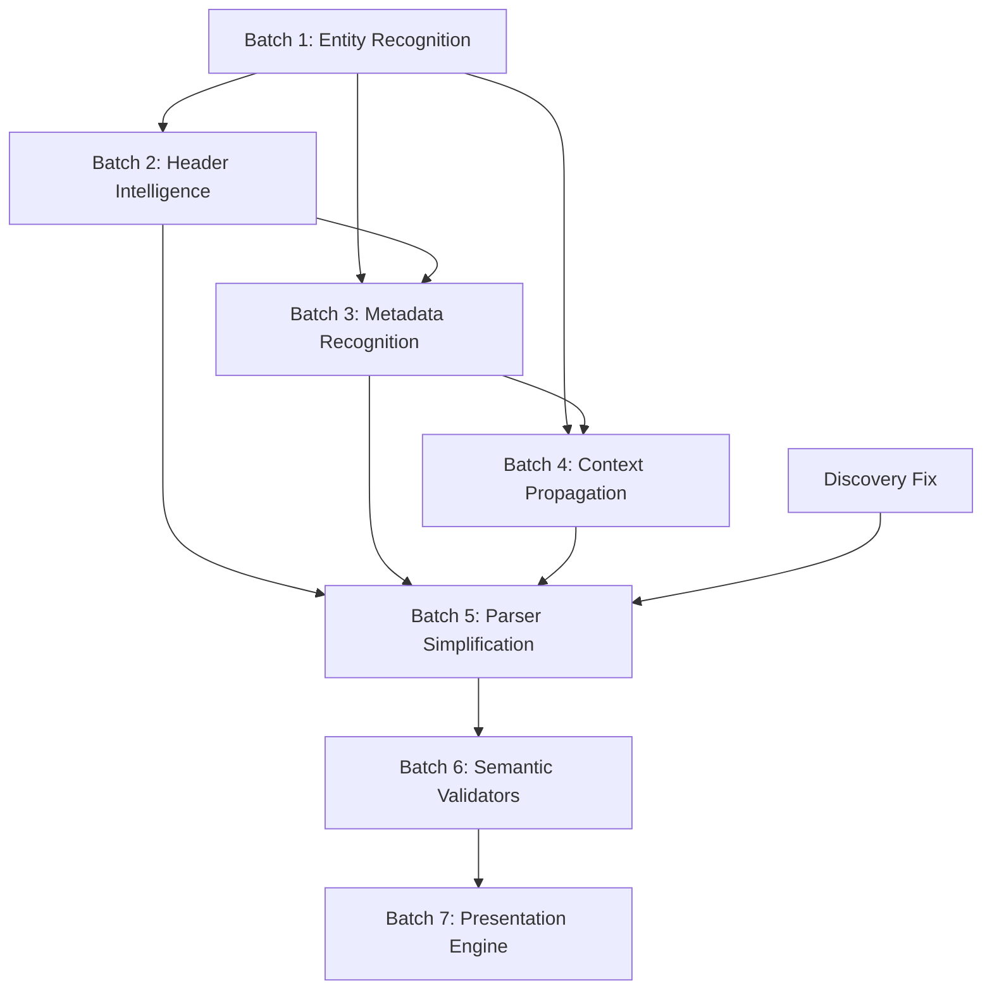

# Regulatory Data Warehouse — Capability-Oriented Improvement Plan

This plan replaces the previous bug-oriented review with a **capability-first** architecture.

Instead of fixing 29 individual bugs, we build **7 engines**. Each engine dissolves entire classes of defects automatically.

---

## Architecture: Before → After

### Current Pipeline

```
Extraction → Normalization → Pattern → Parser → Validate → Export
```

Every parser individually discovers headers, states, utilities, voltages, years, units, notes, hierarchy. Too much responsibility. Every parser fails differently.

### Target Pipeline

```
Extraction → Normalization → DOCUMENT UNDERSTANDING → SEMANTIC UNDERSTANDING → Pattern → Parser → Validate → Export
```

Two new stages. Parsers receive a rich `DocumentContext` and only extract records — they no longer discover metadata.

---

## How This Dissolves Bugs

The previous review identified 29 defects. Here's how capabilities absorb them:

| Capability Engine | Bugs Dissolved |
|---|---|
| **Entity Recognition** (Batch 1) | `"/ Andhra Pradesh*"`, missing states, missing utilities, `"State/UT"` as state, DISCOMs as states, missing UTs |
| **Header Intelligence** (Batch 2) | `"Col 2"`, `"Col 3"`, `"Col 4"`, wrong consumer_category, wrong utility names, multi-row header failures |
| **Metadata Recognition** (Batch 3) | Years as charges, `%` as `Rs/kWh`, hardcoded units, wrong CSS table discovery, voltage as charge |
| **Context Propagation** (Batch 4) | Zero state propagations, empty states, broken hierarchy, lost parent rows, continuation merging |
| **Parser Simplification** (Batch 5) | All parser-level detection code removed. Parsers become thin record extractors |
| **Semantic Validators** (Batch 6) | Validation passes everything, header rows exported, garbage records, duplicate detection |
| **Presentation Engine** (Batch 7) | Column ordering, sheet names, missing summary, missing analysis workbook, autofilters |

---

## Batch 1: Entity Recognition Engine

> **Goal**: Build a unified recognition layer that ALL pipeline stages consume. No more per-parser catalog lookups. No more hardcoded dictionaries.

### What It Does

Provides a single service that can answer:
- "Is this string a state name?" → `EntityMatch(canonical="Andhra Pradesh", confidence=1.0)`
- "Is this string a utility?" → `EntityMatch(canonical="APEPDCL", parent_state="Andhra Pradesh")`
- "Is this string a voltage?" → `EntityMatch(canonical="11 kV", band="HT")`
- "Is this string a year?" → `EntityMatch(canonical="2023-24", type="financial_year")`
- "Is this string a unit?" → `EntityMatch(canonical="Rs/kWh", type="charge_unit")`

### Design

```
EntityRecognizer
├── StateMatcher      (catalog + aliases + fuzzy + context)
├── UtilityMatcher    (catalog + regex + parent-state inference)
├── VoltageMatcher    (pattern-based: kV, HT/LT/EHT)
├── YearMatcher       (regex: FY 20XX-XX, 20XX-XX, 20XX)
├── UnitMatcher       (regex + header context: Rs/kWh, paise/kWh, %)
└── CategoryMatcher   (known categories: Industrial, Domestic, Agriculture...)
```

Each matcher:
1. Checks a **seed catalog** first (fast exact/alias match)
2. Falls back to **pattern recognition** (regex, fuzzy matching)
3. Returns `EntityMatch` with `confidence` score
4. Learns from context (if cell is under a "State/UT" column header, bias toward state matching)

### Proposed Changes

---

#### [NEW] [entity_recognition/](file:///c:/Users/hp/OneDrive/Desktop/TLG/table_scraper/src/table_scraper/entity_recognition/) — New package

##### [NEW] `__init__.py`
Exports `EntityRecognizer` singleton

##### [NEW] `recognizer.py`
`EntityRecognizer` class — facade that orchestrates all matchers. Single entry point for the whole pipeline.

##### [NEW] `matchers/state_matcher.py`
- Loads from `states.yaml` and `state_aliases.yaml`
- Strips `"/"` prefixes, `"*"` suffixes, leading/trailing punctuation — BEFORE matching
- Fuzzy match with `difflib.SequenceMatcher` for OCR errors
- Returns canonical `Title Case` name
- Knows ALL 36 Indian states/UTs

##### [NEW] `matchers/utility_matcher.py`
- Seed catalog: comprehensive Indian DISCOM registry (not hardcoded from one PDF)
- Pattern recognition: `*PDCL`, `*TRANSCO`, `*EDCL`, `*GESCOM` regex patterns
- Parent-state inference: `APEPDCL` → `Andhra Pradesh`
- Falls back gracefully: unknown utilities get `confidence=0.5` instead of `"state_level"`

##### [NEW] `matchers/voltage_matcher.py`
- Detects: `11 kV`, `33 kV`, `66 kV`, `132 kV`, `220 kV`, `400 kV`
- Classifies bands: `LT` (< 11 kV), `HT` (11-33 kV), `EHT` (66+ kV)
- Pattern match: `r'\b(\d+)\s*k[Vv]\b'`, `"High Tension"`, `"Low Tension"`

##### [NEW] `matchers/year_matcher.py`
- Detects financial years: `2023-24`, `FY 2023-24`, `FY23-24`, `2023-2024`
- Detects calendar years: `2023`, `2024`
- Rejects standalone years from being parsed as numeric charges
- Critical: `parse_float("2023-24")` currently returns `2023.0`. This matcher prevents that.

##### [NEW] `matchers/unit_matcher.py`
- Detects: `Rs/kWh`, `paise/kWh`, `Rs/kW/month`, `Rs/MW/day`, `Rs/kVA/month`, `%`
- Context-aware: if header says "Cross-Subsidy (%)", values are percentages, not rupees
- Normalizes: `p/kWh` → `paise/kWh`, `₹/kWh` → `Rs/kWh`

##### [NEW] `matchers/category_matcher.py`
- Seed categories: `Industrial`, `Commercial`, `Domestic`, `Agriculture`, `Railway Traction`, `Mining`, `Bulk Supply`, `Temporary`, `Public Lighting`, `Water Works`
- Subcategory awareness: `HT Industrial`, `LT Industrial`, `Small Industrial`, `Medium Industrial`, `Large Industrial`

---

#### Catalog Improvements

##### [MODIFY] [states.yaml](file:///c:/Users/hp/OneDrive/Desktop/TLG/table_scraper/config/catalogs/states.yaml)
Add ALL 36 states/UTs: Andaman & Nicobar Islands, Chandigarh, Dadra & Nagar Haveli and Daman & Diu, Lakshadweep, Goa (already present but verify)

##### [MODIFY] [state_aliases.yaml](file:///c:/Users/hp/OneDrive/Desktop/TLG/table_scraper/config/catalogs/state_aliases.yaml)
Add comprehensive aliases: AP, HP, MP, UP, UK, WB, TN, A&NI, DNH&DD, J&K (already present), Arunachal PD → Arunachal Pradesh

##### [NEW] [utilities.yaml](file:///c:/Users/hp/OneDrive/Desktop/TLG/table_scraper/config/catalogs/utilities.yaml) — Complete rewrite
Ship comprehensive seed list of ALL Indian DISCOMs, TRANSCOs, and GENCOs organized by state. Include aliases (e.g., `APEPDCL` = `Andhra Pradesh Eastern Power Distribution Company Limited`). NOT hardcoded from one PDF — a reusable national registry.

##### [NEW] `config/catalogs/consumer_categories.yaml`
Canonical consumer categories with aliases and subcategories

##### [NEW] `config/catalogs/voltage_levels.yaml`
Standard voltage levels with band classification

##### [NEW] `config/catalogs/charge_units.yaml`
Known charge units with normalization rules

---

> [!IMPORTANT]
> **Key Principle**: The catalogs are **seed data**, not exhaustive databases. The recognition layer falls back to pattern matching when a value isn't in the catalog. This means new PDFs don't require catalog maintenance for every new entity.

---

## Batch 2: Header Intelligence Engine

> **Goal**: `"Col 2"` should NEVER appear in output. Every column must have a meaningful semantic name.

### What It Does

Builds a `HeaderTree` data structure from multi-row table headers. Every parser consumes the `HeaderTree` instead of raw `row[0]`, `row[1]`.

### Design

```
HeaderAnalyzer
├── detect_header_depth()     → how many rows are headers
├── build_header_tree()       → nested tree from multi-row headers
├── resolve_column_semantics()→ assign meaning: state_col, year_cols, value_cols
└── flatten_for_parser()      → list[ColumnDescriptor] for parser consumption
```

```python
@dataclass
class ColumnDescriptor:
    """Semantic description of one table column."""
    index: int                    # 0-based column index
    raw_headers: list[str]        # text from each header row for this column
    display_name: str             # "Cross-Subsidy % - 2023-24"
    semantic_role: ColumnRole     # STATE, UTILITY, YEAR, VALUE, CATEGORY, NOTES, etc.
    entity_type: EntityType | None # if VALUE, what kind? CHARGE, PERCENTAGE, COUNT
    unit: str | None              # "Rs/kWh", "%", "MUs"
    year: str | None              # "2023-24" if this is a year-specific column
    group: str | None             # "Cross-Subsidy %" or "Energy Consumption"
```

```python
class ColumnRole(str, Enum):
    STATE = "state"
    UTILITY = "utility"
    CATEGORY = "category"
    SUBCATEGORY = "subcategory"
    YEAR = "year"
    VALUE = "value"
    UNIT = "unit"
    NOTES = "notes"
    VOLTAGE = "voltage"
    SERIAL_NUMBER = "serial_number"
    UNKNOWN = "unknown"
```

### How Header Depth Is Detected

1. **Known pattern**: If a row contains only `"State/UT"`, year patterns, or group labels — it's a header row.
2. **Numeric content gate**: If a row has no numeric values and the row below it does — it's probably the last header row.
3. **Entity recognition**: Use Batch 1's `YearMatcher` — if a row is all years, it's a header row.
4. **Repetition detection**: If top rows repeat on the next page (from merge stage), they're headers.

### How Column Semantics Are Assigned

1. If column header contains a recognized state pattern → `ColumnRole.STATE`
2. If column header matches a year → `ColumnRole.YEAR` (and extract the year)
3. If column header contains `"Rs/"` or `"paise/"` or `"%"` → `ColumnRole.VALUE` (and extract unit)
4. If column header matches a voltage → `ColumnRole.VOLTAGE`
5. If column 0 contains the string `"State/UT"` → that column is `STATE`
6. If a group label spans columns (e.g., "Cross-Subsidy (%)") → assign `group` to child columns

### For Cross Subsidy Surcharge (the current worst case)

The CSS table has 3 header rows:

| Row 0 | `""` | `"Cross-Subsidy (%)"` | `""` | `""` | `""` | `"Energy Consumption (in MUs)"` | `""` | `""` | `""` |
| Row 1 | `"/"` (Hindi remnant) | `""` | `""` | `""` | `""` | `""` | `""` | `""` | `""` |
| Row 2 | `"State/UT"` | `"2023-24"` | `"2024-25"` | `"2025-26"` | `"2026-27"` | `"2023-24"` | `"2024-25"` | `"2025-26"` | `"2026-27"` |

The `HeaderAnalyzer` would produce:

| Col | display_name | role | unit | year | group |
|-----|---|---|---|---|---|
| 0 | `"State/UT"` | STATE | — | — | — |
| 1 | `"Cross-Subsidy % - 2023-24"` | VALUE | `%` | `2023-24` | `Cross-Subsidy` |
| 2 | `"Cross-Subsidy % - 2024-25"` | VALUE | `%` | `2024-25` | `Cross-Subsidy` |
| 3 | `"Cross-Subsidy % - 2025-26"` | VALUE | `%` | `2025-26` | `Cross-Subsidy` |
| 4 | `"Cross-Subsidy % - 2026-27"` | VALUE | `%` | `2026-27` | `Cross-Subsidy` |
| 5 | `"Energy Consumption - 2023-24"` | VALUE | `MUs` | `2023-24` | `Energy Consumption` |
| 6 | `"Energy Consumption - 2024-25"` | VALUE | `MUs` | `2024-25` | `Energy Consumption` |
| 7 | `"Energy Consumption - 2025-26"` | VALUE | `MUs` | `2025-26` | `Energy Consumption` |
| 8 | `"Energy Consumption - 2026-27"` | VALUE | `MUs` | `2026-27` | `Energy Consumption` |

**"Col 2" is impossible with this engine.**

### Proposed Changes

---

##### [NEW] `src/table_scraper/understanding/` — New package

##### [NEW] `understanding/__init__.py`

##### [NEW] `understanding/header_analyzer.py`
- `HeaderAnalyzer` class
- `detect_header_depth(table: NormalizedTable) → int`
- `build_header_tree(table: NormalizedTable, depth: int) → HeaderTree`
- `resolve_column_semantics(tree: HeaderTree, recognizer: EntityRecognizer) → list[ColumnDescriptor]`
- Uses Batch 1's entity matchers for year/unit/state detection in headers

##### [NEW] `domain/models.py` additions
- `ColumnDescriptor` dataclass
- `ColumnRole` enum addition to `enums.py`
- `HeaderTree` dataclass (nested structure)
- `DocumentContext` dataclass (aggregates all understanding outputs)

---

## Batch 3: Metadata Recognition Engine

> **Goal**: Classify every cell's semantic role BEFORE parsing. "Is this a state? A year? A charge? A voltage level? A header?" — answered at the table level, not inside each parser.

### What It Does

Annotates the `NormalizedTable` with per-cell metadata tags. Produces a `CellAnnotation` grid parallel to the cell grid.

### Design

```python
@dataclass
class CellAnnotation:
    """Semantic tag for one cell."""
    entity_type: EntityType | None    # STATE, UTILITY, YEAR, VOLTAGE, CHARGE, CATEGORY, NOTES, EMPTY
    canonical_value: str | None       # "Andhra Pradesh", "2023-24", "11 kV"
    confidence: float                 # 0.0 to 1.0
    is_numeric: bool
    numeric_value: float | None
    unit: str | None                  # "Rs/kWh", "%"
    flags: set[str]                   # {"header_row", "continuation", "footnote"}
```

```python
class EntityType(str, Enum):
    STATE = "state"
    UTILITY = "utility"
    YEAR = "year"
    VOLTAGE = "voltage"
    CHARGE = "charge"
    PERCENTAGE = "percentage"
    COUNT = "count"
    CATEGORY = "category"
    UNIT = "unit"
    NOTES = "notes"
    SERIAL_NUMBER = "serial_number"
    HEADER = "header"
    EMPTY = "empty"
    UNKNOWN = "unknown"
```

### How It Works

1. For each cell, run through the `EntityRecognizer` (Batch 1)
2. Use column context from `ColumnDescriptor` (Batch 2) to boost/override
3. Row-level context: if col 0 is a state, col 1+ are likely values or utilities
4. Flag cells that should NEVER become `charge_value`: years, voltages, headers, serial numbers

### Critical Problem This Solves

Currently `parse_float("2023-24")` → `2023.0` → becomes a charge value. With metadata recognition:
- Cell `"2023-24"` → `CellAnnotation(entity_type=YEAR, canonical_value="2023-24", is_numeric=False, flags={"year"})`
- Parser sees `entity_type=YEAR` → skips it. **Year can never become a charge.**

Similarly:
- Cell `"11"` under a `"kV"` header → `CellAnnotation(entity_type=VOLTAGE)` → never becomes a charge
- Cell `"7%"` → `CellAnnotation(entity_type=PERCENTAGE, numeric_value=7.0, unit="%")` → parser uses `unit="%"` not `"Rs/kWh"`

### Proposed Changes

---

##### [NEW] `understanding/metadata_annotator.py`
- `MetadataAnnotator` class
- `annotate_table(table: NormalizedTable, columns: list[ColumnDescriptor], recognizer: EntityRecognizer) → AnnotatedTable`
- Produces `AnnotatedTable` with parallel `CellAnnotation` grid

##### [NEW] `domain/models.py` additions
- `CellAnnotation` dataclass
- `AnnotatedTable` dataclass (extends/wraps `NormalizedTable` + annotations)
- `EntityType` enum in `enums.py`

##### [MODIFY] [text_cleanup.py](file:///c:/Users/hp/OneDrive/Desktop/TLG/table_scraper/src/table_scraper/normalization/text_cleanup.py)
- Move `"/"` prefix stripping and `"*"` suffix stripping into `clean_text()` — this is text normalization, not entity recognition
- The clean text feeds into entity recognition

##### [MODIFY] [base.py](file:///c:/Users/hp/OneDrive/Desktop/TLG/table_scraper/src/table_scraper/parsing/base.py)
- `parse_float()` gains an optional `cell_annotation` parameter
- If annotation says `entity_type=YEAR` or `entity_type=VOLTAGE` → return `None`
- If annotation says `unit="%"` → caller knows to set `charge_unit="%"`

---

## Batch 4: Context Propagation Engine

> **Goal**: Every data row inherits its full semantic context: state, utility, category, voltage, year, unit. No row is ever orphaned.

### What It Does

Maintains a `ParseContext` stack that propagates state, utility, category, etc. from master rows to child/continuation rows.

### Design

```python
@dataclass
class ParseContext:
    """Running semantic context for row-by-row parsing."""
    current_state: str | None = None
    current_utility: str | None = None
    current_category: str | None = None
    current_subcategory: str | None = None
    current_voltage: str | None = None
    current_year: str | None = None
    current_unit: str | None = None
    depth: int = 0                     # hierarchy depth
```

### How It Works

```
Andhra Pradesh         ← context.state = "Andhra Pradesh"
  APEPDCL              ← context.utility = "APEPDCL" (recognized as utility, not state)
    Industrial          ← context.category = "Industrial"
      HT                ← context.voltage = "HT"
        11 kV           ← context.voltage = "HT - 11 kV"
          0.56           ← emit record with FULL context
```

The engine:
1. Reads `CellAnnotation` from Batch 3
2. If col 0 is `STATE` → update `context.state`, reset utility/category/voltage
3. If col 0 is `UTILITY` → update `context.utility`, keep state
4. If col 0 is `CATEGORY` → update `context.category`, keep state + utility
5. If col 0 is `VOLTAGE` → update `context.voltage`
6. Data rows inherit all current context values

### Continuation Row Merging

When two consecutive rows have the same col 0 value and one has mostly empty cells, merge them:
```
["Arunachal Pradesh", "NA", "-58%", "-45%", "",   "NA", "2",  "3",  "4"]
["Arunachal Pradesh", "",   "",    "",     "-39%", "",   "",   "",   ""]
→ merged:
["Arunachal Pradesh", "NA", "-58%", "-45%", "-39%", "NA", "2", "3", "4"]
```

### Replaces

- [hierarchy.py](file:///c:/Users/hp/OneDrive/Desktop/TLG/table_scraper/src/table_scraper/normalization/hierarchy.py) — current state propagation (weak: only 3 propagations)
- [block_segmentation.py](file:///c:/Users/hp/OneDrive/Desktop/TLG/table_scraper/src/table_scraper/normalization/block_segmentation.py) — current block segmentation (partially works, but segment boundaries are wrong because states aren't recognized)
- Per-parser state/utility detection code in all 5 parser families

### Proposed Changes

---

##### [NEW] `understanding/context_engine.py`
- `ContextEngine` class
- `propagate(table: AnnotatedTable, columns: list[ColumnDescriptor]) → ContextualTable`
- `merge_continuation_rows(table: AnnotatedTable) → AnnotatedTable`
- Produces `ContextualTable` with per-row `ParseContext`

##### [MODIFY] [hierarchy.py](file:///c:/Users/hp/OneDrive/Desktop/TLG/table_scraper/src/table_scraper/normalization/hierarchy.py)
- Refactor to use `EntityRecognizer` for state matching (instead of direct catalog lookup)
- State vs utility discrimination via `UtilityMatcher`

##### [MODIFY] [block_segmentation.py](file:///c:/Users/hp/OneDrive/Desktop/TLG/table_scraper/src/table_scraper/normalization/block_segmentation.py)
- Use `AnnotatedTable` and `ParseContext` for block boundaries
- Block state comes from `ParseContext.current_state` (already cleaned and canonical)

---

## Batch 5: Parser Simplification

> **Goal**: Parsers receive `DocumentContext` and ONLY extract records. They do NOT detect headers, states, utilities, voltages, years, or units.

### DocumentContext — The New Parser Input

```python
@dataclass
class DocumentContext:
    """Everything a parser needs, pre-computed by the understanding engines."""
    table: NormalizedTable
    columns: list[ColumnDescriptor]        # from HeaderAnalyzer
    annotations: list[list[CellAnnotation]] # from MetadataAnnotator
    row_contexts: list[ParseContext]        # from ContextEngine
    blocks: list[StateBlock]               # from BlockSegmentation
    recognizer: EntityRecognizer           # for any ad-hoc lookups
    source_pages: list[int]                # actual PDF pages
    parameter_id: str
```

### What Parsers Do Now (Simplified)

```python
def parse(self, ctx: DocumentContext) -> ParseResult:
    for row_idx, row in enumerate(ctx.table.rows):
        row_ctx = ctx.row_contexts[row_idx]
        
        for col in ctx.columns:
            if col.semantic_role != ColumnRole.VALUE:
                continue  # skip non-value columns
            
            annotation = ctx.annotations[row_idx][col.index]
            if annotation.entity_type in {EntityType.YEAR, EntityType.VOLTAGE, EntityType.HEADER}:
                continue  # never extract these as charges
            
            if annotation.numeric_value is None:
                continue
            
            record = ParsedRecord(
                fields={
                    "state": row_ctx.current_state,       # from context
                    "utility": row_ctx.current_utility,    # from context
                    "consumer_category": row_ctx.current_category,
                    "voltage_level": row_ctx.current_voltage or col.voltage or "all",
                    "year_label": col.year or row_ctx.current_year,
                    "charge_value": annotation.numeric_value,
                    "charge_unit": annotation.unit or col.unit or "Rs/kWh",
                },
                source_pages=ctx.source_pages,
                confidence=annotation.confidence,
            )
            records.append(record)
```

**Notice**: The parser is ~20 lines. No header reconstruction. No state detection. No utility catalog lookup. No year parsing. No unit detection. All of that is handled upstream.

### Proposed Changes

---

##### [MODIFY] [base.py](file:///c:/Users/hp/OneDrive/Desktop/TLG/table_scraper/src/table_scraper/parsing/base.py)
- New `BaseParser.parse()` signature: `parse(self, ctx: DocumentContext) → ParseResult`
- Keep backward-compatible `parse(self, table, blocks, config)` as deprecated wrapper

##### [MODIFY] All 6 parser families
- [state_block_matrix.py](file:///c:/Users/hp/OneDrive/Desktop/TLG/table_scraper/src/table_scraper/parsing/families/state_block_matrix.py)
- [numeric_matrix.py](file:///c:/Users/hp/OneDrive/Desktop/TLG/table_scraper/src/table_scraper/parsing/families/numeric_matrix.py)
- [wide_to_long.py](file:///c:/Users/hp/OneDrive/Desktop/TLG/table_scraper/src/table_scraper/parsing/families/wide_to_long.py)
- [narrative.py](file:///c:/Users/hp/OneDrive/Desktop/TLG/table_scraper/src/table_scraper/parsing/families/narrative.py)
- [simple_matrix.py](file:///c:/Users/hp/OneDrive/Desktop/TLG/table_scraper/src/table_scraper/parsing/families/simple_matrix.py)
- [key_value.py](file:///c:/Users/hp/OneDrive/Desktop/TLG/table_scraper/src/table_scraper/parsing/families/key_value.py)

Each parser: remove header reconstruction, state detection, utility lookup, year parsing, unit detection code. Replace with `DocumentContext` consumption.

##### [MODIFY] [parse_stage.py](file:///c:/Users/hp/OneDrive/Desktop/TLG/table_scraper/src/table_scraper/pipeline/stages/parse_stage.py)
- Insert understanding stages between normalization and parsing:
  ```
  geom → cleaned → normalized → HeaderAnalyzer → MetadataAnnotator → ContextEngine → DocumentContext → Parser
  ```

---

## Batch 6: Semantic Validators

> **Goal**: Validation should catch every kind of semantic error, not just "field exists" checks.

### New Validation Rules

| Rule | Type | Description |
|------|------|-------------|
| `year_not_charge` | ERROR | `charge_value` in `[1950, 2100]` and looks like a year → reject |
| `voltage_not_charge` | ERROR | `charge_value` is a standard kV level (11, 33, 66, 132, 220, 400) and context suggests voltage → reject |
| `state_is_canonical` | ERROR | `state` must exist in the entity registry (not `"/"`, `"State/UT"`, `"Col X"`) |
| `utility_belongs_to_state` | WARNING | If both state and utility are populated, utility should be associated with that state |
| `unit_matches_parameter` | ERROR | Cross subsidy → `%` or `Rs/kWh`. Transmission → `Rs/kW/month`. Don't mix them |
| `header_not_record` | ERROR | No record should have `state = "State/UT"` or `consumer_category = "Applicable Year"` |
| `no_col_n_values` | ERROR | `utility` and `consumer_category` must not match `r"Col \d+"` |
| `charge_range_by_parameter` | WARNING | Per-parameter charge ranges (CSS: 0-200, Transmission: 0-500, etc.) |
| `null_state_rejection` | ERROR | `state` must be populated for every record |
| `confidence_gate` | WARNING | Records with `confidence < 0.5` should be flagged |

### Proposed Changes

---

##### [NEW] `validation/rules/semantic_rules.py`
- Implements all semantic validation rules above
- Each rule is a function `check_*(record, recognizer) → ValidationCheck`

##### [MODIFY] [runner.py](file:///c:/Users/hp/OneDrive/Desktop/TLG/table_scraper/src/table_scraper/validation/runner.py)
- Add semantic validation rules to the validation pipeline
- Promote `required_fields` and `state_validation` to ERROR severity
- Use `EntityRecognizer` for state validation instead of raw catalog lookup

---

## Batch 7: Presentation Engine

> **Goal**: Three output workbooks. Each serves a different audience.

### Output 1: `Regulatory_Parameter_Warehouse.xlsx`

The normalized database. Machine-readable. One sheet per parameter.

**Column ordering** (fixed, per parameter):
```
State | Utility | Consumer Category | Voltage Level | Year | Charge Value | Charge Unit | Effective Date | Notes | Confidence
```

**Sheet names**: Display names, not parameter_ids
```
Cross Subsidy Surcharge | Additional Surcharge | Wheeling Charge | Transmission Charge | Banking Charges
```

**Features**:
- Autofilters on every column
- Frozen header row
- Conditional formatting: confidence < 0.5 → yellow highlight
- No `record_id` or `parameter_id` in main view (moved to hidden columns or metadata sheet)

### Output 2: `Cross_Subsidy_By_State.xlsx`

One worksheet per state. Analyst-friendly.

**Sheet structure** (e.g., "Andhra Pradesh" sheet):
```
Utility | Consumer Category | Voltage | Charge | Unit | 2023-24 | 2024-25 | 2025-26 | 2026-27 | Notes | Confidence
```

**Features**:
- State name as sheet tab
- Wide format: years as columns
- Sorted by utility → category → voltage
- Subtotals per utility

### Output 3: `Cross_Subsidy_Analysis.xlsx`

Management dashboard.

**Sheets**:
1. **Summary** — parameter coverage, extraction quality, confidence distribution
2. **State Comparison** — highest/lowest surcharge by state, YoY trends
3. **Utility Comparison** — charges per utility, state-wise breakdown
4. **Voltage Analysis** — HT vs LT vs EHT charge comparison
5. **Data Quality** — extraction confidence histogram, warnings log, source page references
6. **Extraction Metadata** — source PDF, extraction date, pipeline version, pages processed

### Proposed Changes

---

##### [MODIFY] [dataframe_builder.py](file:///c:/Users/hp/OneDrive/Desktop/TLG/table_scraper/src/table_scraper/export/dataframe_builder.py)
- Add column ordering by parameter schema
- Separate audit columns from business columns

##### [MODIFY] [excel_exporter.py](file:///c:/Users/hp/OneDrive/Desktop/TLG/table_scraper/src/table_scraper/export/excel_exporter.py)
- Use `display_name` for sheet titles
- Generate Summary sheet with quality dashboard
- Support multiple output workbooks

##### [MODIFY] [formatter.py](file:///c:/Users/hp/OneDrive/Desktop/TLG/table_scraper/src/table_scraper/export/formatter.py)
- Add autofilters
- Add conditional formatting (confidence-based highlighting)
- Add number formatting (2 decimal places for charges, 0 for counts)

##### [NEW] `export/state_workbook_builder.py`
- Generates per-state worksheets for the CSS workbook
- Pivots long-format records to wide-format (years as columns)

##### [NEW] `export/analysis_workbook_builder.py`
- Generates the analysis workbook with summary, comparisons, and quality metrics

##### [MODIFY] [export_stage.py](file:///c:/Users/hp/OneDrive/Desktop/TLG/table_scraper/src/table_scraper/pipeline/stages/export_stage.py)
- Orchestrate generation of all 3 workbooks

---

## Discovery Fix (Separate from Batches)

> [!CAUTION]
> The CSS parameter currently extracts the **wrong table** (Table-3 instead of Table-5(a)). This must be fixed regardless of which batch is being implemented.

##### [MODIFY] [parameter_aliases.yaml](file:///c:/Users/hp/OneDrive/Desktop/TLG/table_scraper/config/discovery/parameter_aliases.yaml)
- Change `"cross subsidy"` alias to require `"surcharge"` for the CSS parameter
- Add match specificity: `"Cross Subsidy Surcharge"` must match Table-5(a), not Table-3

---

## Implementation Order & Dependencies



**Estimated effort per batch**:

| Batch | Files Changed | New Files | Complexity |
|-------|---------------|-----------|------------|
| 1 | 3 catalogs | ~8 new files | Medium — mostly data + matching logic |
| 2 | 0 | ~3 new files | Medium — tree construction + column analysis |
| 3 | 2 existing | ~2 new files | Medium — annotation loop + entity integration |
| 4 | 2 existing | ~1 new file | Medium — context state machine |
| 5 | 8 existing | 0 | High — refactor all parsers + pipeline |
| 6 | 1 existing | ~1 new file | Low — rule functions |
| 7 | 3 existing | ~2 new files | Medium — Excel formatting + pivoting |

---

## Verification Plan

### After Each Batch

Run the full pipeline and check:

| Check | After Batch |
|-------|-------------|
| Entity recognition resolves all 36 states | 1 |
| No `"Col N"` in any header | 2 |
| No year value as `charge_value` | 3 |
| State propagation covers all rows | 4 |
| All parsers use `DocumentContext` | 5 |
| Validation blocks garbage records | 6 |
| Three workbooks generated | 7 |

### Final Validation

```bash
python -m table_scraper run
```

- Open `Regulatory_Parameter_Warehouse.xlsx` — verify every sheet has clean, semantically correct data
- Open `Cross_Subsidy_By_State.xlsx` — verify one sheet per state, wide format with years as columns
- Open `Cross_Subsidy_Analysis.xlsx` — verify summary and comparison sheets
- Compare a random sample of 20 records against the PDF source of truth
- Confirm zero `"Col N"` values, zero year-as-charge, zero empty states, zero `"/"` prefix states

---

> [!IMPORTANT]
> **Approval Required**: This is a significant capability upgrade across 7 batches. Please review the batch structure, the new domain models, and the file layout. I recommend starting with Batch 1 (Entity Recognition) as it unblocks everything downstream. Shall I proceed?
