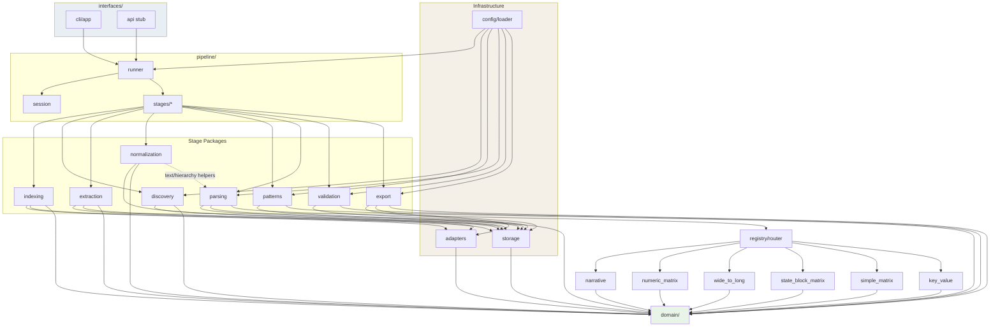

# Production Software Architecture — Regulatory PDF Table Extraction Pipeline

This design treats the system as a **layered, plugin-based ETL framework** scoped per PDF session. It merges the two exploratory tracks (parameter-registry Excel path + state-block/query path) into one architecture with a shared discovery/extraction core and pluggable parser families.

---

## Architectural Principles

| Principle | How it is enforced |
|-----------|-------------------|
| **Modularity** | One module ≈ one responsibility; packages map to pipeline stages |
| **Low coupling** | Domain models and protocols sit in the center; adapters at the edges |
| **Extensibility** | Parser plugins + YAML profiles; no central switch-statement growth |
| **Multi-PDF support** | PDF-scoped **workspace** keyed by content hash; profiles override defaults |
| **Minimal Cursor tokens** | Small files, external config, `ARCHITECTURE.md` index, no cross-layer imports |
| **Testability** | Pure functions in normalization/patterns; fake PDF adapter in tests |

**Dependency rule (global):** dependencies flow **inward** only — `interfaces → pipeline → stage packages → domain`. Nothing in `domain/` imports pdfplumber, openpyxl, or SQLite.

---

## 1. Complete Folder Structure

```text
table_scraper/
│
├── ARCHITECTURE.md                 # Short index: layers, rules, where to add things
├── README.md
├── pyproject.toml
├── requirements.txt
│
├── config/                         # All behavior that varies — not Python logic
│   ├── defaults.yaml               # Global pipeline defaults
│   ├── pdf_profiles/               # One file per PDF edition / publisher
│   │   └── cerc_ursi_v1.yaml
│   ├── discovery/                  # TOC regex, title patterns, search synonyms
│   │   ├── toc_patterns.yaml
│   │   └── parameter_aliases.yaml
│   ├── patterns/                   # Pattern classifier signals
│   │   └── pattern_signatures.yaml
│   ├── parsers/                    # Parser plugin registration + per-parameter overrides
│   │   ├── registry.yaml
│   │   └── parameters/
│   │       ├── banking_charges.yaml
│   │       ├── transmission_charge.yaml
│   │       ├── wheeling_charge.yaml
│   │       ├── additional_surcharge.yaml
│   │       └── cross_subsidy_surcharge.yaml
│   └── catalogs/                   # Reference data
│       ├── states.yaml
│       ├── state_aliases.yaml
│       └── utilities.yaml
│
├── docs/                           # Specification & notebooks (existing)
├── project.md                      # Domain analysis (existing)
│
├── src/
│   └── table_scraper/
│       ├── __init__.py
│       │
│       ├── domain/                 # Pure types, protocols, errors — zero I/O
│       │   ├── models.py
│       │   ├── enums.py
│       │   ├── protocols.py
│       │   └── errors.py
│       │
│       ├── config/                 # Load & validate YAML → typed settings
│       │   ├── loader.py
│       │   └── schema.py
│       │
│       ├── storage/                # Workspace layout & artifact I/O
│       │   ├── workspace.py
│       │   ├── artifact_store.py
│       │   └── sqlite_index.py
│       │
│       ├── adapters/               # External library wrappers (thin)
│       │   ├── pdf_reader.py
│       │   └── excel_writer.py
│       │
│       ├── indexing/               # Full-PDF page index
│       │   ├── page_indexer.py
│       │   └── title_detector.py
│       │
│       ├── discovery/              # TOC, parameters, page ranges
│       │   ├── toc_extractor.py
│       │   ├── parameter_catalog.py
│       │   ├── page_range_resolver.py
│       │   └── page_offset_calibrator.py
│       │
│       ├── extraction/             # Raw table pull from PDF pages
│       │   ├── table_extractor.py
│       │   ├── table_selector.py
│       │   └── table_merger.py
│       │
│       ├── normalization/          # Geometry & text cleanup (pre-parse)
│       │   ├── geometry.py
│       │   ├── text_cleanup.py
│       │   ├── hierarchy.py
│       │   └── block_segmentation.py
│       │
│       ├── patterns/               # Automatic pattern detection
│       │   ├── classifier.py
│       │   ├── features.py
│       │   └── signatures.py
│       │
│       ├── parsing/                # Semantic parsers (plugin registry)
│       │   ├── base.py
│       │   ├── registry.py
│       │   ├── router.py
│       │   └── families/
│       │       ├── narrative.py
│       │       ├── numeric_matrix.py
│       │       ├── wide_to_long.py
│       │       ├── state_block_matrix.py
│       │       ├── simple_matrix.py
│       │       └── key_value.py
│       │
│       ├── validation/             # Post-parse quality checks
│       │   ├── runner.py
│       │   └── rules/
│       │
│       ├── export/                 # Excel warehouse output
│       │   ├── dataframe_builder.py
│       │   ├── excel_exporter.py
│       │   └── formatter.py
│       │
│       ├── pipeline/               # Stage orchestration (no business logic)
│       │   ├── session.py
│       │   ├── stages/
│       │   │   ├── index_stage.py
│       │   │   ├── discover_stage.py
│       │   │   ├── extract_stage.py
│       │   │   ├── parse_stage.py
│       │   │   └── export_stage.py
│       │   └── runner.py
│       │
│       └── interfaces/             # User-facing entry points
│           ├── cli/
│           │   ├── app.py
│           │   └── prompts.py
│           └── api/                # Optional future HTTP API — empty stub
│               └── __init__.py
│
├── tests/
│   ├── unit/
│   ├── integration/
│   └── fixtures/
│       ├── sample_pages/
│       └── golden/                 # Expected JSON/Excel snapshots
│
├── workspaces/                     # Runtime output (gitignored)
│   └── {pdf_content_hash}/
│       ├── manifest.json
│       ├── index/
│       ├── discovery/
│       ├── extraction/
│       ├── parsing/
│       └── export/
│
└── scripts/
    ├── inspect_parameter.py        # Dev helper — schema discovery CLI
    └── validate_workspace.py
```

---

## 2. Responsibilities of Every Folder

| Folder | Responsibility |
|--------|----------------|
| **`config/`** | Declarative behavior: regex, aliases, parser bindings, column maps, validation thresholds. Edited without touching Python. |
| **`docs/`** | Human specification and research notebooks — not imported at runtime. |
| **`src/table_scraper/domain/`** | Shared vocabulary: `PageIndex`, `Parameter`, `RawTable`, `ExtractedRecord`, protocols. Stable contracts. |
| **`src/table_scraper/config/`** | Reads YAML, merges profile + defaults, validates structure. |
| **`src/table_scraper/storage/`** | Where artifacts live; workspace lifecycle; SQLite FTS index. |
| **`src/table_scraper/adapters/`** | Isolate pdfplumber, openpyxl, pandas from business logic. Swap libraries here only. |
| **`src/table_scraper/indexing/`** | Scan entire PDF once; build searchable page index. |
| **`src/table_scraper/discovery/`** | TOC → parameter list → page ranges → offset calibration. |
| **`src/table_scraper/extraction/`** | Given page range, produce merged raw tables. |
| **`src/table_scraper/normalization/`** | Structural/text cleanup before semantic parsing. |
| **`src/table_scraper/patterns/`** | Infer table pattern from normalized table features. |
| **`src/table_scraper/parsing/`** | Plugin parsers; each emits `List[ExtractedRecord]`. |
| **`src/table_scraper/validation/`** | Optional gates: record counts, required fields, state coverage. |
| **`src/table_scraper/export/`** | Records → DataFrame → formatted Excel. |
| **`src/table_scraper/pipeline/`** | Wire stages; manage session state; no parsing rules. |
| **`src/table_scraper/interfaces/`** | CLI prompts, future API — thin wrappers over pipeline. |
| **`tests/`** | Unit tests per module; golden files for regression. |
| **`workspaces/`** | Per-PDF isolated cache — safe for hundreds of documents. |
| **`scripts/`** | Developer utilities outside the main pipeline. |

---

## 3. Responsibilities of Every Module

### Domain (`domain/`)

| Module | Responsibility |
|--------|----------------|
| **`models.py`** | Dataclasses: `PdfDocument`, `PageRecord`, `ParameterDefinition`, `PageRange`, `RawTable`, `NormalizedTable`, `StateBlock`, `ExtractedRecord`, `ParseResult`, `WorkspaceManifest`. |
| **`enums.py`** | `TablePattern`, `ParserFamily`, `ArtifactKind`, `SessionStage`. |
| **`protocols.py`** | Structural typing: `PdfReader`, `ParserPlugin`, `PatternClassifier`, `ArtifactStore`, `ExcelExporter`. |
| **`errors.py`** | `DiscoveryError`, `ExtractionError`, `PatternUnknownError`, `ParserNotFoundError`, `ValidationError`. |

### Config (`config/`)

| Module | Responsibility |
|--------|----------------|
| **`loader.py`** | Merge `defaults.yaml` + `pdf_profiles/{profile}.yaml` + parameter YAML. |
| **`schema.py`** | Validate config shape; reject unknown parser IDs at startup. |

### Storage (`storage/`)

| Module | Responsibility |
|--------|----------------|
| **`workspace.py`** | Create/open workspace from PDF path; track manifest and stage completion. |
| **`artifact_store.py`** | Read/write JSON, CSV, Parquet; path conventions; cache invalidation by stage. |
| **`sqlite_index.py`** | FTS5 page search; optional — indexing stage writes, discovery reads. |

### Adapters (`adapters/`)

| Module | Responsibility |
|--------|----------------|
| **`pdf_reader.py`** | Open PDF, extract text/tables per page, context-manager lifecycle. |
| **`excel_writer.py`** | Write sheets, apply formatting via openpyxl. |

### Indexing (`indexing/`)

| Module | Responsibility |
|--------|----------------|
| **`page_indexer.py`** | Iterate all pages; build `List[PageRecord]`; persist index. |
| **`title_detector.py`** | Apply configurable regex; extract `table_titles` from page text. |

### Discovery (`discovery/`)

| Module | Responsibility |
|--------|----------------|
| **`toc_extractor.py`** | Parse TOC pages; emit raw TOC entries. |
| **`parameter_catalog.py`** | Merge TOC + index anchors; filter supported parameters; dedupe spurious matches. |
| **`page_range_resolver.py`** | Compute `{start, end}` via anchor chain or TOC ordering. |
| **`page_offset_calibrator.py`** | Map TOC printed page → PDF index using phrase search. |

### Extraction (`extraction/`)

| Module | Responsibility |
|--------|----------------|
| **`table_extractor.py`** | Extract all tables per page in range. |
| **`table_selector.py`** | Pick primary table (rows × cols heuristic; overridable per parameter). |
| **`table_merger.py`** | Concatenate pages; strip repeated headers. |

### Normalization (`normalization/`)

| Module | Responsibility |
|--------|----------------|
| **`geometry.py`** | Drop empty rows/columns; compress sparse rows. |
| **`text_cleanup.py`** | `clean_text`, `extract_english`, CID artifact removal. |
| **`hierarchy.py`** | State forward-fill; master/child/continuation classification helpers. |
| **`block_segmentation.py`** | Split matrices into state blocks (year + bilingual name heuristics). |

### Patterns (`patterns/`)

| Module | Responsibility |
|--------|----------------|
| **`features.py`** | Compute shape signals: header depth, category rows, voltage keywords, DISCOM density. |
| **`signatures.py`** | Load pattern signatures from config. |
| **`classifier.py`** | Score signatures → `TablePattern` + confidence; fallback to config override. |

### Parsing (`parsing/`)

| Module | Responsibility |
|--------|----------------|
| **`base.py`** | Abstract `ParserPlugin`: `pattern`, `parse(normalized_table, config) → ParseResult`. |
| **`registry.py`** | Register plugins from config; lookup by pattern or parameter ID. |
| **`router.py`** | Pattern + parameter config → select parser; handle override vs auto-detect. |
| **`families/*`** | One file per parser family implementation. |

### Validation (`validation/`)

| Module | Responsibility |
|--------|----------------|
| **`runner.py`** | Run rule set for a parameter; return warnings/errors. |
| **`rules/`** | Pluggable checks: min records, required columns, state count. |

### Export (`export/`)

| Module | Responsibility |
|--------|----------------|
| **`dataframe_builder.py`** | `List[ExtractedRecord]` → typed DataFrame with column order from config. |
| **`excel_exporter.py`** | Multi-sheet workbook creation. |
| **`formatter.py`** | Freeze panes, bold headers, column width clamp — presentation only. |

### Pipeline (`pipeline/`)

| Module | Responsibility |
|--------|----------------|
| **`session.py`** | Holds workspace, config, user selections, confirmed page range. |
| **`stages/*`** | One stage = one pipeline step; idempotent if artifact exists. |
| **`runner.py`** | Execute stages in order; skip completed; surface progress. |

### Interfaces (`interfaces/`)

| Module | Responsibility |
|--------|----------------|
| **`cli/app.py`** | Entry point: `index`, `discover`, `extract`, `run` (full flow). |
| **`cli/prompts.py`** | Parameter list, page range confirm/edit, preview first N lines. |

---

## 4. Public Interface for Every Module

Interfaces are **Python protocols or small facades** — the contracts future code must honor.

### Domain (exported types — import from `table_scraper.domain`)

- `PdfDocument`, `PageRecord`, `ParameterDefinition`, `PageRange`
- `RawTable`, `NormalizedTable`, `StateBlock`, `ExtractedRecord`, `ParseResult`
- `TablePattern`, `ParserFamily` enums
- Exception hierarchy

### Config

- **`load_settings(pdf_path, profile_name=None) → AppSettings`**
- **`load_parameter_config(parameter_id) → ParameterConfig`**

### Storage

- **`Workspace.open(pdf_path) → Workspace`**
  - `.manifest`, `.path_for(ArtifactKind, parameter_id=None)`, `.mark_stage_complete(stage)`
- **`ArtifactStore.read(kind, ...) → T`** / **`.write(kind, data, ...)`**
- **`PageSearchIndex.query(text, limit=20) → List[int]`** (page numbers)

### Adapters

- **`PdfReader.open(path) → PdfReader`** (context manager)
  - `.page_count`, `.extract_text(page)`, `.extract_tables(page)`
- **`ExcelWriter.write(sheets: Dict[str, DataFrame], path, format_spec) → None`**

### Indexing

- **`build_page_index(pdf: PdfReader, workspace, config) → PageIndexResult`**
  - Returns summary: pages indexed, pages with titles

### Discovery

- **`extract_toc(pdf, config) → List[TocEntry]`**
- **`build_parameter_catalog(toc, page_index, config) → List[ParameterDefinition]`**
  - Each item: `id`, `display_name`, `suggested_range`, `supported: bool`, `table_title`
- **`resolve_page_range(parameter, page_index, config) → PageRange`**
- **`calibrate_page_offset(toc_page, pdf, phrase) → int`**
- **`preview_pages(pdf, page_range, lines=15) → Dict[int, str]`**

### Extraction

- **`extract_raw_tables(pdf, page_range, config) → RawTable`**
- **`merge_multi_page_tables(pages: List[PageTable], config) → RawTable`**

### Normalization

- **`normalize_geometry(raw: RawTable) → NormalizedTable`**
- **`normalize_text_cells(table) → NormalizedTable`**
- **`propagate_hierarchy(table, rules) → NormalizedTable`**
- **`segment_state_blocks(table, config) → List[StateBlock]`**

### Patterns

- **`classify_table(normalized: NormalizedTable, config) → PatternClassification`**
  - `{pattern: TablePattern, confidence: float, signals: dict}`

### Parsing

- **`ParserRegistry.get(pattern | parameter_id) → ParserPlugin`**
- **`ParserPlugin.parse(table, blocks, config) → ParseResult`**
  - `ParseResult`: `{records: List[ExtractedRecord], metadata: dict}`
- **`route_and_parse(normalized, classification, parameter_config) → ParseResult`**

### Validation

- **`validate_parse_result(result, parameter_config) → ValidationReport`**

### Export

- **`records_to_dataframe(records, schema) → DataFrame`**
- **`export_to_excel(dataframes, path, format_config) → ExportResult`**

### Pipeline

- **`PipelineSession`** — state container
- **`run_pipeline(session, stages: List[Stage]) → PipelineResult`**
- Stage functions (each independently callable):
  - **`stage_index(session)`**
  - **`stage_discover(session)`**
  - **`stage_extract(session, parameter_id, page_range)`**
  - **`stage_parse(session, parameter_id)`**
  - **`stage_export(session, parameter_id, output_path)`**

### CLI (user workflow)

- **`main()`** — dispatches subcommands
- Interactive flow:
  1. **`index <pdf>`**
  2. **`parameters`** — list supported + discovered
  3. **`select <parameter_id>`** — show suggested range + preview
  4. **`confirm-range [--start N] [--end N]`**
  5. **`extract`** — run extract → classify → parse → export

---

## 5. Data Flow Between Modules

```text
                         ┌─────────────┐
                         │  CLI / API  │
                         └──────┬──────┘
                                │ commands
                                ▼
                         ┌─────────────┐
                         │  Pipeline   │
                         │   Runner    │
                         └──────┬──────┘
                                │
     ┌──────────────────────────┼──────────────────────────┐
     │                          │                          │
     ▼                          ▼                          ▼
┌─────────┐              ┌───────────┐              ┌───────────┐
│ Index   │──PageIndex──▶│ Discover  │──Parameters─▶│ User      │
│ Stage   │              │ Stage     │              │ Confirm   │
└────┬────┘              └─────┬─────┘              │ PageRange │
     │                         │                   └─────┬─────┘
     │ persist                 │                         │
     ▼                         ▼                         ▼
┌─────────┐              ┌───────────┐              ┌───────────┐
│ SQLite  │◀─────────────│ Workspace │─────────────▶│ Extract   │
│ FTS     │              │ Artifacts │              │ Stage     │
└─────────┘              └───────────┘              └─────┬─────┘
                                                          │ RawTable
                                                          ▼
                                                    ┌───────────┐
                                                    │ Normalize │
                                                    └─────┬─────┘
                                                          │ NormalizedTable
                                                          ▼
                                                    ┌───────────┐
                                                    │ Patterns  │
                                                    │ Classifier│
                                                    └─────┬─────┘
                                                          │ TablePattern
                                                          ▼
                                                    ┌───────────┐
                                                    │ Parsing   │
                                                    │ Router    │
                                                    └─────┬─────┘
                                                          │ ParseResult
                                                          ▼
                                                    ┌───────────┐
                                                    │ Validate  │
                                                    └─────┬─────┘
                                                          │
                                                          ▼
                                                    ┌───────────┐
                                                    │ Export    │
                                                    │ → Excel   │
                                                    └───────────┘
```

**Data object evolution:**

| Stage | Primary object | Persists as |
|-------|----------------|-------------|
| Index | `List[PageRecord]` | `index/page_index.json`, `index/page_index.db` |
| Discover | `List[ParameterDefinition]` | `discovery/parameter_catalog.json` |
| User confirm | `PageRange` (confirmed) | `discovery/{param}_range.json` |
| Extract | `RawTable` | `extraction/{param}/raw_table.json` |
| Normalize | `NormalizedTable` | `extraction/{param}/normalized.json` |
| Classify | `PatternClassification` | `parsing/{param}/pattern.json` |
| Parse | `List[ExtractedRecord]` | `parsing/{param}/records.json` |
| Export | `.xlsx` | `export/{param}.xlsx` |

---

## 6. Modules That Must Never Depend on Each Other

These pairs are **forbidden direct imports** (enforce via lint rule or import checker):

| A | B | Reason |
|---|---|--------|
| **`domain/`** | anything except stdlib/typing | Core must stay pure |
| **`parsing/families/*`** | **`interfaces/`** | Parsers never know about CLI |
| **`parsing/families/*`** | **`adapters/`** | Parsers receive already-extracted tables |
| **`indexing/`** | **`parsing/`** | Index before parse — no circular need |
| **`export/`** | **`discovery/`** | Export consumes records only |
| **`export/`** | **`adapters/pdf_reader`** | Export never reads PDF |
| **`patterns/`** | **`parsing/`** | Classifier must not invoke parsers (avoid feedback loop) |
| **`normalization/`** | **`parsing/`** | Cleanup is pre-semantic |
| **`discovery/`** | **`extraction/`** | Discovery resolves location only |
| **`interfaces/cli/`** | **`parsing/families/*`** | CLI talks to pipeline only, not individual parsers |
| **Parser family A** | **Parser family B** | No cross-family imports; register via registry only |

**Allowed dependency direction:**

```text
interfaces → pipeline → {indexing, discovery, extraction, normalization,
                          patterns, parsing, validation, export}
                       → storage, config, adapters
                       → domain
```

---

## 7. Modules Reusable Across Future Projects

These could become a standalone **`pdf_table_kit`** library later:

| Module | Reuse scope |
|--------|-------------|
| **`domain/models.py`** (subset) | Any PDF table ETL |
| **`adapters/pdf_reader.py`** | Any pdfplumber project |
| **`indexing/`** | Any searchable PDF corpus |
| **`extraction/table_selector.py`**, **`table_merger.py`** | Generic multi-page table extraction |
| **`normalization/geometry.py`**, **`text_cleanup.py`** | Any messy PDF tables |
| **`patterns/classifier.py`** (framework) | Pattern-agnostic with new signatures YAML |
| **`parsing/base.py`**, **`registry.py`**, **`router.py`** | Plugin host for any domain |
| **`export/excel_exporter.py`**, **`formatter.py`** | Generic record → Excel |
| **`storage/workspace.py`**, **`artifact_store.py`** | Any staged pipeline with caching |
| **`pipeline/runner.py`** | Generic stage runner pattern |

**Domain-specific (Indian regulatory)** but reusable within this product line:

- **`normalization/hierarchy.py`**, **`block_segmentation.py`**
- **`config/catalogs/states.yaml`**
- Query/search synonym lists (if added later)

---

## 8. Parameter-Specific Modules

| Item | Location | Notes |
|------|----------|-------|
| Parser implementations | `parsing/families/*.py` | Banking logic ≠ wheeling logic |
| Parameter YAML | `config/parsers/parameters/*.yaml` | Column maps, header keywords, skip rules |
| Validation rules | `validation/rules/{parameter_id}.py` | Optional per-parameter |
| Excel column order / sheet name | parameter YAML | `{sheet_name, columns, dtypes}` |
| Pattern override | parameter YAML | Force pattern when classifier uncertain |
| Registry entry | `config/parsers/registry.yaml` | Maps `parameter_id → parser_id → pattern` |

**Not parameter-specific** (shared parser families):

| Parser family | Serves many parameters |
|---------------|------------------------|
| `narrative` | Banking, future policy tables |
| `numeric_matrix` | Transmission, similar charge matrices |
| `wide_to_long` | Wheeling, any voltage/category wide grid |
| `state_block_matrix` | Cross-subsidy, open-access matrices |
| `simple_matrix` | Category × utility flat grids |
| `key_value` | Simple two-column metric tables |

Adding parameter #31 = **new YAML file** + optionally **reuse existing family** — not a new pipeline.

---

## 9. Modules That Should Be Configurable (Not Hardcoded)

| Concern | Config file | Example |
|---------|-------------|---------|
| TOC page count | `defaults.yaml` | `toc_max_pages: 15` |
| TOC / title regex | `discovery/toc_patterns.yaml` | TABLE-N matching |
| Parameter aliases & search terms | `discovery/parameter_aliases.yaml` | "banking charges" → `banking_charges` |
| Supported parameters (v1 filter) | `pdf_profiles/*.yaml` | `supported_parameters: [...]` |
| Page range strategy | `defaults.yaml` | `anchor_chain` vs `toc_next_start` |
| Offset calibration phrases | parameter YAML | `calibration_phrase: "Banking Charges"` |
| Largest-table heuristic | `defaults.yaml` | `selector: largest_area` |
| Header detection keywords | parameter YAML | `header_patterns: [...]` |
| Column index maps | parameter YAML | `columns: {state: 0, discom: 1, ...}` |
| Wide-to-long dimension map | parameter YAML | `wheeling: {Below 11 kV: 5, ...}` |
| State/utility catalogs | `config/catalogs/` | Canonical names + aliases |
| Pattern signatures | `patterns/pattern_signatures.yaml` | Feature weights |
| Parser routing | `parsers/registry.yaml` | pattern → parser_id |
| Validation thresholds | parameter YAML | `min_records: 20` |
| Excel formatting | `defaults.yaml` | `max_column_width: 60` |
| OCR fallback (future) | `defaults.yaml` | `ocr_enabled: false`, triggers |
| Workspace retention | `defaults.yaml` | TTL, compress old workspaces |

**Rule:** if a value came from a notebook magic number (`iloc[6]`, `idx <= 6`), it belongs in **parameter YAML**, not Python.

---

## 10. Intermediate Artifacts to Save

### Always persist (enables resume, debug, re-parse without re-read PDF)

| Artifact | Format | Path | Purpose |
|----------|--------|------|---------|
| Workspace manifest | JSON | `manifest.json` | PDF hash, profile, stages done, timestamps |
| Page index | JSON | `index/page_index.json` | Full page metadata |
| Page search index | SQLite | `index/page_index.db` | FTS5 queries |
| Page index (flat) | CSV | `index/page_index.csv` | Human inspection |
| TOC raw entries | JSON | `discovery/toc_raw.json` | Debug TOC regex |
| Parameter catalog | JSON | `discovery/parameter_catalog.json` | User-facing list |
| Parameter ranges (suggested) | JSON | `discovery/parameter_ranges.json` | Before user edit |
| Confirmed range | JSON | `discovery/{param_id}/confirmed_range.json` | User-approved |
| Page previews | JSON | `discovery/{param_id}/preview.json` | First N lines per page |
| Raw extracted tables | JSON | `extraction/{param_id}/raw_pages.json` | Per-page tables pre-merge |
| Merged raw table | JSON | `extraction/{param_id}/raw_merged.json` | Post-merge |
| Normalized table | JSON | `extraction/{param_id}/normalized.json` | Post-geometry/text |
| State blocks (if used) | JSON | `extraction/{param_id}/state_blocks.json` | Matrix parameters |
| Pattern classification | JSON | `parsing/{param_id}/pattern.json` | Audit routing decision |
| Parsed records | JSON | `parsing/{param_id}/records.json` | Canonical output |
| Validation report | JSON | `parsing/{param_id}/validation.json` | Warnings/errors |
| Final Excel | XLSX | `export/{param_id}.xlsx` | Deliverable |

### Optional / debug-only (toggle via `defaults.yaml`)

| Artifact | When |
|----------|------|
| Table shape report | `debug: true` — all tables per page with dimensions |
| Classifier feature dump | Pattern misclassification investigation |
| Intermediate CSV snapshots | Quick Excel inspection without full export |

### Do not persist

| Item | Reason |
|------|--------|
| Open `PdfReader` handles | Runtime only |
| In-memory DataFrames (unless checkpointing) | Rebuild from JSON |
| CLI prompt state | Session memory only |

**Cache invalidation:** changing `confirmed_range.json` invalidates `extraction/` and downstream for that parameter only. Changing PDF file hash invalidates entire workspace.

---

## 11. Dependency Graph



**Legend:** solid arrows = direct imports; dotted = shared utility only (no orchestration import).

---

## 12. Suggestions Before Implementation

### A. Resolve open design decisions now

1. **Unify the two notebook tracks** — Cross-subsidy uses `state_block_matrix` + `simple_matrix` + `key_value`, not generic `numeric`. Encode this in `registry.yaml` now.
2. **Canonical page numbering** — Standardize on **1-based PDF index** everywhere; store TOC printed page separately; auto-compute offset in discovery stage.
3. **Section boundary authority** — Default: **index anchor chain**; fall back to TOC next-start; user confirmation always wins.
4. **v1 supported parameters** — Explicit list in profile YAML (`supported: true/false` per parameter); unsupported parameters appear in list but cannot be extracted until parser exists.

### B. Structural improvements

5. **Workspace-per-PDF** — Enables hundreds of PDFs without artifact collision; CLI accepts `--workspace` override.
6. **Stage idempotency** — Each stage checks artifact + input hash; skip if unchanged — saves time during parser tuning.
7. **Parser plugin protocol** — Register via entry points (`pyproject.toml [project.entry-points]`) later for third-party parsers without editing core.
8. **Schema registry** — Define output column schemas in YAML; parsers validate their own output against schema before export.
9. **`ARCHITECTURE.md` at repo root** — One page: layers, forbidden imports, "how to add a parameter" checklist — reduces Cursor context load.
10. **Keep files under ~150 lines** — Split `numeric_matrix.py` into detect + parse if needed; aids incremental development.

### C. Pattern detection strategy

11. **Two-phase routing:** config override (if `force_pattern` set) → else classifier → else `inspect`-mode prompt user to pick pattern (CLI fallback for unknown layouts).
12. **Confidence threshold** — Below 0.7 confidence, require user confirmation of detected pattern before parse.

### D. Quality & operations

13. **Golden tests** — One fixture PDF snippet per parser family; compare `records.json` to golden file.
14. **Validation gate** — Warn on export; block only on critical errors (configurable).
15. **Structured logging** — JSON logs per stage with `parameter_id`, `workspace_id`, record counts — production observability.

### E. Future-proofing (don't build yet, leave seams)

16. **`adapters/ocr_reader.py`** — Empty protocol implementation for scanned PDF fallback.
17. **`interfaces/api/`** — Same `PipelineSession` as CLI; no duplicate logic.
18. **Query layer** — Optional post-export module reading `records.json`; not in v1 critical path.

### F. Cursor / token efficiency

19. **Never import notebooks** — `docs/` is reference only.
20. **Parameter work = touch 2 files** — `config/parsers/parameters/new_param.yaml` + optionally one family extension — document this in `ARCHITECTURE.md`.
21. **Avoid a `utils.py` junk drawer** — utilities live in the normalization stage they belong to.

---

## Recommended v1 Implementation Order

1. `domain/` + `config/` + `storage/workspace.py`
2. `adapters/pdf_reader.py` + `indexing/` + `discovery/`
3. `interfaces/cli/prompts.py` (parameter list + range confirm)
4. `extraction/` + `normalization/geometry.py` + `text_cleanup.py`
5. `patterns/classifier.py` (basic signatures)
6. `parsing/registry.py` + **one** family (narrative / banking)
7. `export/` end-to-end for single parameter
8. Remaining parser families + cross-subsidy block path
9. Validation + golden tests

---

This architecture keeps the **workflow you specified** as the spine, isolates **PDF-specific** behavior in profiles and parameter YAML, and scales to **hundreds of PDFs** via workspaces and plugin parsers without rewriting the pipeline core. When you're ready to implement, we should start with `domain/`, `config/`, and `storage/` — everything else hangs off those contracts.